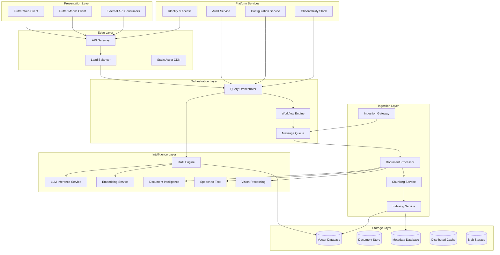
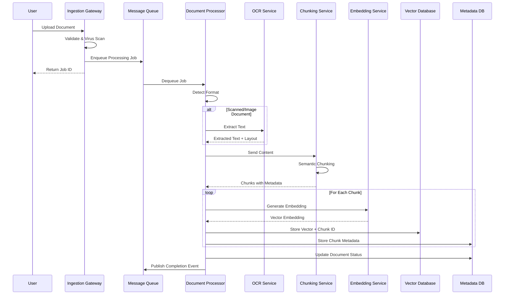
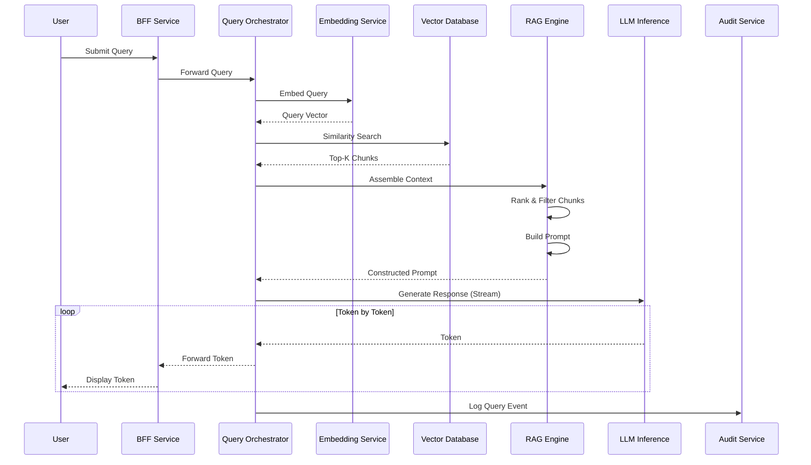
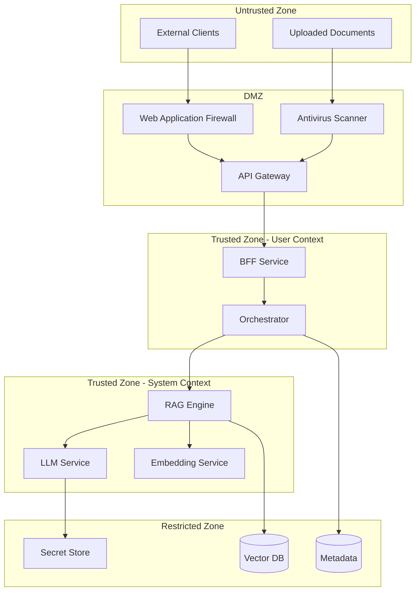
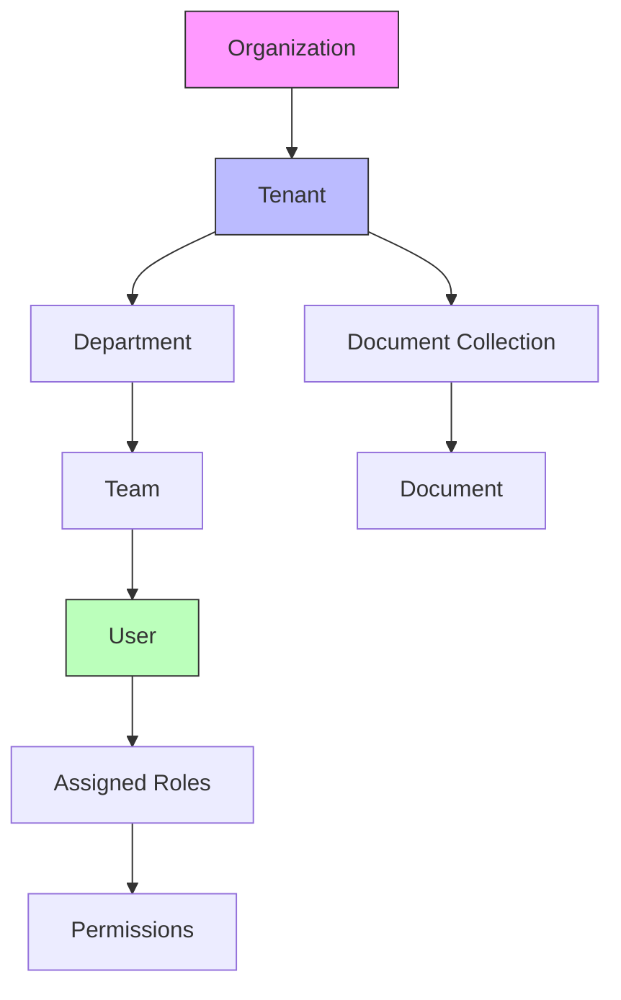

# Phase 0: Strategic Foundation & System Genesis

**Document Classification:** Enterprise Architecture Specification  
**Version:** 0.1.0  
**Status:** Draft for Stakeholder Review  
**Authors:** Principal Systems Architect  
**Date:** 2026-01-08

---

## Table of Contents

1. [System Vision & Product Definition](#1-system-vision--product-definition)
2. [Architecture Definition](#2-architecture-definition)
3. [Service Boundary Specification](#3-service-boundary-specification)
4. [Data & Knowledge Flow](#4-data--knowledge-flow)
5. [AI Governance & Model Strategy](#5-ai-governance--model-strategy)
6. [Security & Compliance Baseline](#6-security--compliance-baseline)
7. [Repository & Engineering Standards](#7-repository--engineering-standards)

---

## 1. System Vision & Product Definition

### 1.1 Platform Identity

**What This Platform Is:**

An enterprise-grade, self-hosted AI knowledge and reasoning layer that enables organizations to:

- Ingest, process, and understand multimodal documents (PDFs, scanned images, audio, video, text)
- Build and maintain organizational knowledge graphs from unstructured data
- Provide retrieval-augmented generation (RAG) capabilities for accurate, contextual AI responses
- Support multilingual querying and response generation across business units
- Operate under strict data sovereignty, security, and compliance constraints

**What This Platform Is NOT:**

| Exclusion | Rationale |
|-----------|-----------|
| A SaaS product | Must be fully self-hostable in private cloud or on-premises environments |
| A chatbot or virtual assistant | It is an AI reasoning layer; presentation is delegated to consuming applications |
| A document management system | Document storage is a means to an end, not the primary capability |
| A search engine replacement | RAG augments search with reasoning, not keyword matching |
| A model training platform | Model fine-tuning is out of scope; inference and orchestration are in scope |
| An off-the-shelf LLM wrapper | Custom orchestration, governance, and enterprise integration are core |

### 1.2 Primary Enterprise Use Cases

| Use Case ID | Domain | Description | Key Requirements |
|-------------|--------|-------------|------------------|
| UC-001 | Legal & Compliance | Contract analysis, clause extraction, regulatory cross-referencing | High accuracy, audit trails, redaction support |
| UC-002 | Customer Support | Knowledge-base-powered response generation for support agents | Low latency (<2s), citation of source documents |
| UC-003 | Research & Development | Technical document synthesis, patent analysis, prior art discovery | Multilingual support, large context windows |
| UC-004 | Human Resources | Policy Q&A, onboarding material generation, benefits explanation | Multi-tenant isolation per department |
| UC-005 | Executive Intelligence | Strategic report summarization, competitive intelligence synthesis | Role-based access, sensitive data handling |
| UC-006 | Operations | Standard operating procedure retrieval, incident response guidance | Offline capability, version-controlled documents |

### 1.3 Non-Functional Requirements (NFRs)

#### 1.3.1 Performance

| Metric | Target | Measurement Methodology |
|--------|--------|------------------------|
| Query-to-First-Token Latency | ≤ 500ms (P95) | Measured from API gateway receipt to first streaming token |
| Full Response Latency | ≤ 5s for standard queries (P95) | End-to-end including retrieval and generation |
| Document Ingestion Throughput | ≥ 100 documents/minute (sustained) | Per ingestion worker node |
| Concurrent Users | ≥ 5,000 simultaneous sessions | Active query sessions, not idle connections |
| Concurrent Queries | ≥ 500 queries/second | Peak load capacity |

#### 1.3.2 Reliability

| Metric | Target | Notes |
|--------|--------|-------|
| System Availability | 99.9% (three nines) | Excluding planned maintenance windows |
| Recovery Time Objective (RTO) | ≤ 15 minutes | For critical path services |
| Recovery Point Objective (RPO) | ≤ 5 minutes | For knowledge base state |
| Mean Time Between Failures (MTBF) | ≥ 720 hours | Per service instance |

#### 1.3.3 Scalability

| Dimension | Requirement |
|-----------|-------------|
| Horizontal Scaling | All stateless services must scale linearly to 100+ instances |
| Data Volume | Support ≥ 10 million documents per tenant |
| Tenant Count | Support ≥ 100 isolated tenants |
| Model Parallelism | Support distributed inference across GPU clusters |

#### 1.3.4 Maintainability

| Aspect | Requirement |
|--------|-------------|
| Deployment Frequency | Support daily deployments with zero downtime |
| Rollback Time | ≤ 5 minutes to previous known-good state |
| Configuration Change Propagation | ≤ 30 seconds across all instances |
| Log Retention | ≥ 90 days for operational logs, ≥ 7 years for audit logs |

---

## 2. Architecture Definition

### 2.1 Overall System Topology



### 2.2 Architectural Style Justification: Microservices

**Decision:** Adopt a microservices architecture with well-defined domain boundaries.

**Why Microservices Over Alternatives:**

| Alternative | Reason for Rejection |
|-------------|---------------------|
| Monolith | Cannot meet horizontal scaling requirements for individual components (e.g., LLM inference scales differently than document ingestion) |
| Modular Monolith | Insufficient fault isolation; a memory leak in OCR processing would impact query serving |
| Serverless/FaaS | Cold start latency incompatible with P95 requirements; GPU workloads unsuitable for FaaS |
| Service-Oriented Architecture (SOA) | ESB-style orchestration creates central bottlenecks; microservices with event-driven communication preferred |

**Microservices Benefits for This Platform:**

1. **Independent Scaling:** LLM inference can scale on GPU nodes while ingestion scales on CPU-optimized nodes
2. **Technology Heterogeneity:** Embedding service can use optimized ONNX runtime while orchestration uses async Python
3. **Fault Isolation:** OCR service crashes do not impact real-time query serving
4. **Deployment Independence:** Model updates deploy without frontend redeployment
5. **Team Autonomy:** Domain teams own services end-to-end

**Acknowledged Trade-offs:**

- Increased operational complexity (mitigated by Kubernetes orchestration)
- Distributed transaction management (mitigated by saga patterns and eventual consistency)
- Service discovery overhead (mitigated by service mesh)
- Network latency between services (mitigated by co-location and caching)

### 2.3 Domain Separation

The platform is organized into five primary domains, each with distinct responsibilities:

#### 2.3.1 Ingestion Domain

**Responsibility:** Accept, validate, and prepare documents for processing.

| Component | Function |
|-----------|----------|
| Ingestion Gateway | API endpoint for document upload; validation; virus scanning |
| Document Processor | Format detection; content extraction; metadata extraction |
| Chunking Service | Semantic chunking; overlap management; chunk-document linking |
| Indexing Service | Vector embedding generation; index population; deduplication |

**Characteristics:**
- Write-heavy workload
- Tolerates eventual consistency (minutes)
- Horizontally scalable per document type

#### 2.3.2 Intelligence Domain

**Responsibility:** Provide AI capabilities including inference, embedding, and multimodal understanding.

| Component | Function |
|-----------|----------|
| LLM Inference Service | Model hosting; prompt execution; streaming response generation |
| Embedding Service | Text embedding; query embedding; semantic similarity |
| RAG Engine | Retrieval strategy; context assembly; prompt construction |
| Document Intelligence (OCR) | Optical character recognition; layout analysis; table extraction |
| Speech-to-Text | Audio transcription; speaker diarization; timestamp alignment |
| Vision Processing | Image captioning; visual Q&A; diagram understanding |

**Characteristics:**
- Compute-intensive (GPU-bound)
- Latency-sensitive for inference
- Stateless (models loaded at startup)

#### 2.3.3 Storage Domain

**Responsibility:** Persist and retrieve all data with appropriate access patterns.

| Component | Function |
|-----------|----------|
| Vector Database | High-dimensional vector storage; similarity search |
| Document Store | Original document binary storage; versioning |
| Metadata Database | Structured metadata; relationships; search indexes |
| Distributed Cache | Query result caching; session state; rate limiting |
| Blob Storage | Large binary objects; archive storage |

**Characteristics:**
- Stateful services requiring careful backup/recovery
- Different consistency requirements per store
- Encryption at rest mandatory

#### 2.3.4 Orchestration Domain

**Responsibility:** Coordinate cross-service workflows and manage system behavior.

| Component | Function |
|-----------|----------|
| Query Orchestrator | Request routing; retrieval-generation coordination; response assembly |
| Workflow Engine | Multi-step process management; retry logic; compensation |
| Message Queue | Async communication; load leveling; event distribution |
| Configuration Service | Feature flags; runtime configuration; A/B testing |

**Characteristics:**
- Stateless compute (state in external stores)
- High availability critical (single point of failure risk)
- Observability focus

#### 2.3.5 Presentation Domain

**Responsibility:** Deliver user interfaces and external API access.

| Component | Function |
|-----------|----------|
| Flutter Web Client | Browser-based UI; responsive design |
| Flutter Mobile Client | iOS/Android native apps; offline capability |
| API Gateway | External API exposure; rate limiting; authentication |
| BFF (Backend-for-Frontend) | Flutter-optimized API; aggregation; transformation |

**Characteristics:**
- User-facing latency sensitivity
- Platform-specific considerations (mobile vs web)
- Caching opportunities

---

## 3. Service Boundary Specification

### 3.1 Service Catalog

| Service ID | Service Name | Domain | Team Ownership |
|------------|--------------|--------|----------------|
| SVC-001 | API Gateway | Presentation | Platform Team |
| SVC-002 | BFF Service | Presentation | Frontend Team |
| SVC-003 | Query Orchestrator | Orchestration | Core Team |
| SVC-004 | Workflow Engine | Orchestration | Core Team |
| SVC-005 | RAG Engine | Intelligence | AI Team |
| SVC-006 | LLM Inference | Intelligence | AI Team |
| SVC-007 | Embedding Service | Intelligence | AI Team |
| SVC-008 | OCR Service | Intelligence | AI Team |
| SVC-009 | Ingestion Gateway | Ingestion | Data Team |
| SVC-010 | Document Processor | Ingestion | Data Team |
| SVC-011 | Chunking Service | Ingestion | Data Team |
| SVC-012 | Indexing Service | Ingestion | Data Team |
| SVC-013 | Auth Service | Platform | Platform Team |
| SVC-014 | Audit Service | Platform | Platform Team |

### 3.2 Service Specifications

#### SVC-003: Query Orchestrator

**Responsibility:**  
Receives user queries, coordinates retrieval from the RAG engine, manages context assembly, invokes LLM inference, and streams responses back to clients.

**Inputs:**

| Input | Source | Format | Validation |
|-------|--------|--------|------------|
| User Query | API Gateway | JSON (QueryRequest) | Non-empty, max 10,000 characters |
| Conversation Context | BFF Service | JSON (ConversationHistory) | Max 50 turns |
| User Identity Token | Auth Service | JWT | Valid signature, non-expired |
| Tenant Context | Request Header | String (tenant_id) | Exists in tenant registry |

**Outputs:**

| Output | Destination | Format | Characteristics |
|--------|-------------|--------|-----------------|
| Streamed Response | BFF Service | Server-Sent Events | Chunked tokens |
| Response Metadata | BFF Service | JSON (ResponseMeta) | Citations, confidence |
| Audit Event | Audit Service | JSON (AuditPayload) | Async, fire-and-forget |
| Metrics | Observability | Prometheus format | Request latency, token counts |

**Data Contracts:**

```
QueryRequest {
  query: string                    // User's natural language question
  conversation_id: string?         // Optional conversation context
  retrieval_config: {
    top_k: int                     // Number of chunks to retrieve (default: 10)
    similarity_threshold: float    // Minimum relevance score (0.0-1.0)
    filters: {
      document_types: string[]?    // Filter by document type
      date_range: DateRange?       // Filter by document date
      collections: string[]?       // Limit to specific collections
    }
  }
  generation_config: {
    max_tokens: int                // Maximum response length
    temperature: float             // Randomness (0.0-1.0)
    stream: boolean                // Enable streaming response
  }
}

QueryResponse {
  response_id: string
  content: string                  // Generated response text
  citations: Citation[]            // Source document references
  metadata: {
    model_version: string
    retrieval_count: int
    token_usage: TokenUsage
    latency_ms: int
  }
}
```

**Failure Isolation Strategy:**

| Failure Mode | Detection | Response | Recovery |
|--------------|-----------|----------|----------|
| RAG Engine Timeout | Circuit breaker (5s) | Return cached result or graceful error | Retry with exponential backoff |
| LLM Inference Failure | Health check failure | Fallback to secondary model | Alert on-call; auto-restart |
| Embedding Service Down | Connection refused | Queue query for retry | Maximum 3 retries over 30s |
| Memory Pressure | OOM signals | Shed load (reject new requests) | Horizontal scale-out trigger |

---

#### SVC-006: LLM Inference Service

**Responsibility:**  
Host and serve LLM models, execute inference requests, manage model lifecycle, and provide token streaming.

**Inputs:**

| Input | Source | Format | Validation |
|-------|--------|--------|------------|
| Prompt | Query Orchestrator | JSON (InferenceRequest) | Max context window (varies by model) |
| Generation Parameters | Query Orchestrator | JSON (GenerationConfig) | Valid temperature, top_p ranges |
| Model Selection | Configuration Service | String (model_id) | Registered model identifier |

**Outputs:**

| Output | Destination | Format | Characteristics |
|--------|-------------|--------|-----------------|
| Token Stream | Query Orchestrator | SSE | Real-time token emission |
| Completion Response | Query Orchestrator | JSON (CompletionResponse) | Full response with metadata |
| Usage Metrics | Observability | Prometheus | Tokens/second, queue depth |

**Data Contracts:**

```
InferenceRequest {
  prompt: string                   // Formatted prompt with context
  model_id: string                 // Target model identifier
  parameters: {
    max_new_tokens: int            // Maximum tokens to generate
    temperature: float             // Sampling temperature
    top_p: float                   // Nucleus sampling parameter
    top_k: int                     // Top-k sampling parameter
    repetition_penalty: float      // Repetition penalty
    stop_sequences: string[]       // Early termination tokens
  }
  stream: boolean                  // Enable token streaming
  request_id: string               // Tracing correlation ID
}

CompletionResponse {
  request_id: string
  model_id: string
  content: string
  finish_reason: enum [STOP, LENGTH, ERROR]
  usage: {
    prompt_tokens: int
    completion_tokens: int
    total_tokens: int
  }
  timing: {
    queue_time_ms: int
    inference_time_ms: int
    total_time_ms: int
  }
}
```

**Failure Isolation Strategy:**

| Failure Mode | Detection | Response | Recovery |
|--------------|-----------|----------|----------|
| GPU OOM | CUDA error code | Reject request; do not retry | Reduce batch size; alert |
| Model Corruption | Checksum mismatch | Block service startup | Re-download from artifact store |
| Inference Timeout | Watchdog timer (60s) | Kill process; return error | Restart worker process |
| Rate Limit Exceeded | Token bucket exhausted | Return 429; queue if possible | Auto-scale inference replicas |

---

#### SVC-009: Ingestion Gateway

**Responsibility:**  
Accept document uploads, perform initial validation, virus scanning, and queue documents for processing.

**Inputs:**

| Input | Source | Format | Validation |
|-------|--------|--------|------------|
| Document Binary | Client Upload | Multipart form-data | Max 500MB; allowed MIME types |
| Document Metadata | Client | JSON (DocumentMeta) | Required fields present |
| User Identity | Auth Service | JWT | Valid, authorized for upload |

**Outputs:**

| Output | Destination | Format | Characteristics |
|--------|-------------|--------|-----------------|
| Ingestion Job ID | Client | JSON (JobResponse) | Immediate acknowledgment |
| Processing Event | Message Queue | JSON (ProcessingJob) | Async processing trigger |
| Virus Scan Result | Audit Service | JSON (ScanResult) | Security logging |

**Data Contracts:**

```
DocumentUpload {
  file: Binary                     // Document content
  filename: string                 // Original filename
  content_type: string             // MIME type
  metadata: {
    title: string?                 // Display title
    description: string?           // Document description
    collection_id: string?         // Target collection
    tags: string[]?                // Classification tags
    language: string?              // ISO 639-1 language code
    retention_policy: string?      // Data lifecycle policy
  }
}

JobResponse {
  job_id: string                   // UUID for tracking
  status: enum [QUEUED, PROCESSING, COMPLETED, FAILED]
  estimated_completion: datetime?  // Estimated processing time
  tracking_url: string             // Status polling endpoint
}
```

**Failure Isolation Strategy:**

| Failure Mode | Detection | Response | Recovery |
|--------------|-----------|----------|----------|
| Virus Detected | AV engine positive | Reject upload; quarantine | Alert security team |
| Storage Full | Disk space threshold | Reject uploads; alert | Expand storage; cleanup |
| Queue Unavailable | Connection failure | Store locally; retry queue | Maximum local buffer 1GB |
| Invalid Format | Parser error | Return validation error | Log for analysis |

### 3.3 Inter-Service Communication Patterns

| Pattern | Use Case | Implementation |
|---------|----------|----------------|
| Synchronous Request/Response | Query orchestration, Auth validation | gRPC with deadline propagation |
| Streaming | Token generation, Large file transfer | gRPC streaming, SSE |
| Async Messaging | Document ingestion, Audit events | RabbitMQ / Apache Kafka |
| Event Sourcing | Audit trail, State reconstruction | Kafka with compaction |
| Pub/Sub | Configuration updates, Cache invalidation | Redis Pub/Sub |

---

## 4. Data & Knowledge Flow

### 4.1 Document Lifecycle: Upload to AI Answer



### 4.2 Query Lifecycle: Question to Answer



### 4.3 Knowledge Transformation Stages

| Stage | Input | Transformation | Output | Storage |
|-------|-------|----------------|--------|---------|
| 1. Reception | Raw binary file | Validation, decompression | Validated document | Blob Storage |
| 2. Extraction | Binary document | OCR, parsing, format conversion | Plain text + structure | Temp storage |
| 3. Enrichment | Plain text | Language detection, entity recognition | Annotated text | Metadata DB |
| 4. Chunking | Annotated text | Semantic segmentation | Discrete chunks | Document Store |
| 5. Embedding | Text chunks | Vector encoding | Dense vectors | Vector DB |
| 6. Indexing | Vectors + metadata | Index construction | Searchable index | Vector DB |
| 7. Retrieval | User query | Similarity search | Relevant chunks | Memory |
| 8. Generation | Prompt + context | LLM inference | Natural language | Response stream |

### 4.4 Trust Boundaries



**Trust Boundary Rules:**

| Boundary Crossing | Required Controls |
|-------------------|-------------------|
| External → DMZ | WAF inspection, rate limiting, TLS termination |
| DMZ → User Context | JWT validation, tenant context injection |
| User Context → System Context | Service-to-service authentication (mTLS) |
| System Context → Restricted | Database authentication, encryption in transit |
| Any → Secrets | Vault authentication, audit logging, short-lived tokens |

---

## 5. AI Governance & Model Strategy

### 5.1 Model Selection Rationale

**Primary Model: Qwen (Qwen2.5 family)**

| Criterion | Qwen Assessment | Alternative (LLaMA) | Decision Factor |
|-----------|-----------------|---------------------|-----------------|
| Multilingual Capability | Excellent (Chinese, English, 20+ languages) | Good (primarily English) | Enterprise requires global language support |
| Context Window | 128K tokens (Qwen2.5-72B) | 128K tokens (LLaMA 3.1) | Parity; both sufficient |
| License | Apache 2.0 (permissive) | Llama 3 Community License | Qwen more permissive for enterprise |
| Model Sizes Available | 0.5B to 72B | 8B to 405B | Qwen offers more granular sizing |
| Inference Efficiency | Optimized for vLLM | Optimized for vLLM | Parity |
| Self-Hosting Viability | Full weights available | Full weights available | Both viable |
| Fine-tuning Support | LoRA, QLoRA supported | LoRA, QLoRA supported | Parity |

**Model Tier Strategy:**

| Tier | Model | Use Case | Hardware Requirement |
|------|-------|----------|---------------------|
| Tier 1 (Speed) | Qwen2.5-7B-Instruct | Simple queries, suggestions | 1x A100 40GB |
| Tier 2 (Balance) | Qwen2.5-32B-Instruct | Standard RAG queries | 2x A100 80GB |
| Tier 3 (Quality) | Qwen2.5-72B-Instruct | Complex analysis, legal review | 4x A100 80GB |

**LLaMA Compatibility Plan:**

LLaMA models will be supported as secondary options for:
- Fallback during Qwen service degradation
- A/B testing of response quality
- Customer preference in specific deployments

Implementation requires:
- Unified inference interface abstracting model specifics
- Model-agnostic prompt templates with model-specific rendering
- Separate model artifact storage per model family

### 5.2 Model Versioning & Rollback Strategy

**Version Naming Convention:**
```
{model_family}-{size}-{variant}-{version}-{fine_tune_id}
Example: qwen2.5-32b-instruct-v1.2.0-ft_legal_001
```

**Versioning Policy:**

| Version Component | Change Trigger | Impact |
|-------------------|----------------|--------|
| Major (v1.x.x → v2.x.x) | Base model change, architecture change | Full regression testing required |
| Minor (v1.1.x → v1.2.x) | Fine-tuning update, prompt adjustment | Standard testing |
| Patch (v1.1.1 → v1.1.2) | Configuration change, optimization | Smoke testing |

**Rollback Procedure:**

1. **Immediate Rollback (< 5 minutes)**
   - Traffic routing updated at load balancer level
   - Previous model version assumed still warm
   - No model reloading required

2. **Standard Rollback (< 30 minutes)**
   - Previous model artifacts pulled from storage
   - Model loaded into inference servers
   - Gradual traffic shift (canary rollback)

3. **Emergency Rollback (< 2 minutes)**
   - Hard cutover to known-good version
   - All in-flight requests terminated
   - Used only for safety-critical issues

**Model Artifact Storage:**

| Artifact Type | Storage | Retention |
|---------------|---------|-----------|
| Model weights | S3-compatible blob storage | 3 most recent major versions |
| Configuration | Git repository | Indefinite |
| Fine-tuning datasets | Encrypted blob storage | Per compliance policy |
| Evaluation results | Metadata database | Indefinite |

### 5.3 Explainability & Hallucination Mitigation

#### 5.3.1 Explainability Principles

**Requirement:** Every AI-generated response must be traceable to source documents.

**Implementation:**

| Component | Explainability Feature |
|-----------|----------------------|
| RAG Engine | Return chunk IDs, similarity scores, and source document references with every response |
| LLM Response | Generate inline citations using structured markers (e.g., `[1]`, `[2]`) |
| BFF Service | Render citations as clickable links to source documents |
| Audit Service | Log complete context (query, retrieved chunks, prompt, response) |

**Citation Format:**

```json
{
  "citation_id": "1",
  "document_id": "doc_abc123",
  "document_title": "Q3 2025 Financial Report",
  "chunk_id": "chunk_789",
  "page_number": 15,
  "relevance_score": 0.94,
  "text_excerpt": "Revenue increased by 15% compared to..."
}
```

#### 5.3.2 Hallucination Mitigation

**Strategy: Defense in Depth**

| Layer | Technique | Implementation |
|-------|-----------|----------------|
| 1. Retrieval Quality | High-precision retrieval | Tuned similarity thresholds; chunk overlap; reranking |
| 2. Prompt Engineering | Grounded generation prompts | System prompts enforce citation requirements |
| 3. Response Validation | Fact verification | Cross-reference claims against retrieved content |
| 4. Confidence Scoring | Uncertainty quantification | Flag low-confidence responses for human review |
| 5. User Feedback | Hallucination reporting | Feedback loop for model improvement |

**Grounded Generation Prompt Template (Simplified):**

```
You are an enterprise knowledge assistant. Answer ONLY using the provided context.

RULES:
1. If the answer is not in the context, say "I don't have information about that."
2. Cite sources using [1], [2], etc.
3. Never invent facts, statistics, or quotes.
4. If uncertain, express uncertainty explicitly.

CONTEXT:
{retrieved_chunks}

USER QUESTION:
{user_query}
```

**Confidence Scoring:**

| Confidence Level | Score Range | Action |
|------------------|-------------|--------|
| High | 0.85 - 1.0 | Serve response directly |
| Medium | 0.60 - 0.84 | Serve with disclaimer |
| Low | 0.40 - 0.59 | Request clarification or escalate |
| Very Low | 0.0 - 0.39 | Decline to answer; suggest alternatives |

---

## 6. Security & Compliance Baseline

### 6.1 Identity Model

#### 6.1.1 Entity Hierarchy



#### 6.1.2 Role Definitions

| Role | Scope | Permissions |
|------|-------|-------------|
| System Administrator | Organization | Full system access; tenant management; audit access |
| Tenant Administrator | Tenant | User management; collection management; usage reports |
| Collection Owner | Collection | Document CRUD; access grants; retention settings |
| Analyst | Assigned Collections | Query; view documents; export (if permitted) |
| Viewer | Assigned Collections | Query; view documents (no export) |
| API Consumer | Assigned Scopes | Programmatic access per granted scopes |

#### 6.1.3 Authentication Methods

| Method | Use Case | Implementation |
|--------|----------|----------------|
| SSO (SAML 2.0) | Enterprise users | Integration with corporate IdP |
| SSO (OIDC) | Enterprise users | Modern IdP integration |
| API Keys | Service accounts | Long-lived; scope-limited; rotatable |
| mTLS | Service-to-service | Certificate-based mutual authentication |
| JWT | Session tokens | Short-lived; signed; contains claims |

### 6.2 Data Isolation Strategy

#### 6.2.1 Multi-Tenancy Model

**Approach: Logical Isolation with Physical Safeguards**

| Layer | Isolation Mechanism |
|-------|---------------------|
| Application | Tenant ID in all queries; middleware enforcement |
| Database | Row-level security; tenant ID in all tables |
| Vector Database | Separate namespaces per tenant |
| Blob Storage | Tenant-prefixed paths; IAM policies |
| Encryption | Tenant-specific encryption keys |
| Network | No direct tenant-to-tenant communication |

#### 6.2.2 Data Classification

| Classification | Description | Handling Requirements |
|----------------|-------------|----------------------|
| Public | Approved for external sharing | Standard encryption |
| Internal | General business use | Tenant isolation; access logging |
| Confidential | Sensitive business data | Enhanced access controls; audit |
| Restricted | Highly sensitive (PII, financial) | Encryption at field level; DLP scanning |

### 6.3 Auditability Requirements

#### 6.3.1 Audit Events

| Event Category | Examples | Retention |
|----------------|----------|-----------|
| Authentication | Login, logout, failed attempts, token refresh | 2 years |
| Authorization | Permission grants, role changes, access denials | 7 years |
| Data Access | Document views, query execution, exports | 7 years |
| Data Modification | Upload, update, delete, bulk operations | 7 years |
| Administration | User CRUD, tenant configuration, system settings | 7 years |
| AI Operations | Query prompts (optional), response generation | Per policy |

#### 6.3.2 Audit Log Schema

```json
{
  "event_id": "uuid",
  "timestamp": "ISO8601",
  "event_type": "string",
  "actor": {
    "user_id": "string",
    "tenant_id": "string",
    "ip_address": "string",
    "user_agent": "string"
  },
  "resource": {
    "type": "string",
    "id": "string",
    "name": "string"
  },
  "action": "string",
  "outcome": "SUCCESS | FAILURE | PARTIAL",
  "details": {},
  "correlation_id": "string"
}
```

### 6.4 Encryption & Secret Management

#### 6.4.1 Encryption Standards

| Data State | Encryption | Algorithm | Key Length |
|------------|------------|-----------|------------|
| In Transit | Required | TLS 1.3 | - |
| At Rest (storage) | Required | AES-256-GCM | 256-bit |
| At Rest (database) | Required | Transparent Data Encryption | 256-bit |
| Field-level (sensitive) | Required for PII | AES-256-GCM | 256-bit per tenant |

#### 6.4.2 Key Management

| Key Type | Management | Rotation |
|----------|------------|----------|
| TLS Certificates | Automated (Let's Encrypt or internal CA) | 90 days |
| Database Encryption Keys | HSM or Vault | Annual |
| Tenant Data Keys | Vault (per-tenant) | Annual or on-demand |
| API Keys | Vault | On-demand; revocable |
| Service Credentials | Vault | 30 days |

#### 6.4.3 Secret Management Principles

1. **No secrets in code:** All secrets retrieved from Vault at runtime
2. **Short-lived tokens:** Dynamic secrets with automatic expiration
3. **Least privilege:** Secrets scoped to minimum required access
4. **Audit trail:** All secret access logged
5. **Rotation support:** Applications must handle secret rotation gracefully

---

## 7. Repository & Engineering Standards

### 7.1 Repository Strategy

**Decision: Monorepo with Service Boundaries**

**Justification:**

| Factor | Monorepo Advantage | Multi-Repo Alternative |
|--------|-------------------|----------------------|
| Cross-service changes | Single PR for coordinated changes | Multiple PRs; sync complexity |
| Shared libraries | Direct imports; version consistency | Package publishing; version drift |
| CI/CD | Unified pipeline; build graph optimization | Per-repo pipelines; coordination |
| Code visibility | All code searchable; easier onboarding | Fragmented; discovery overhead |
| Atomic refactoring | Single commit for renames | Coordinated releases required |

**Trade-offs Accepted:**
- Larger repository size (mitigated by sparse checkout)
- Build time (mitigated by build caching)
- Access control granularity (mitigated by CODEOWNERS)

### 7.2 Repository Structure

```
waqediAI/
├── .github/
│   ├── workflows/           # CI/CD pipelines
│   └── CODEOWNERS           # Ownership mapping
├── docs/
│   ├── architecture/        # ADRs, system design
│   ├── api/                 # API documentation
│   ├── runbooks/            # Operational procedures
│   └── onboarding/          # Developer guides
├── services/
│   ├── api-gateway/
│   ├── bff-service/
│   ├── query-orchestrator/
│   ├── rag-engine/
│   ├── llm-inference/
│   ├── embedding-service/
│   ├── ocr-service/
│   ├── ingestion-gateway/
│   ├── document-processor/
│   ├── chunking-service/
│   ├── indexing-service/
│   ├── auth-service/
│   └── audit-service/
├── libs/
│   ├── common/              # Shared utilities
│   ├── contracts/           # API contracts (Protobuf, OpenAPI)
│   ├── testing/             # Test utilities
│   └── observability/       # Logging, metrics, tracing
├── infra/
│   ├── kubernetes/          # K8s manifests
│   ├── terraform/           # Infrastructure as code
│   └── docker/              # Dockerfiles
├── clients/
│   ├── flutter-web/
│   └── flutter-mobile/
├── tools/
│   ├── scripts/             # Build and utility scripts
│   └── generators/          # Code generators
└── configs/
    ├── dev/
    ├── staging/
    └── prod/
```

### 7.3 Naming Conventions

#### 7.3.1 Code Naming

| Element | Convention | Example |
|---------|------------|---------|
| Python modules | snake_case | `document_processor.py` |
| Python classes | PascalCase | `DocumentProcessor` |
| Python functions | snake_case | `process_document()` |
| Python constants | SCREAMING_SNAKE | `MAX_CHUNK_SIZE` |
| Environment variables | SCREAMING_SNAKE | `DATABASE_URL` |
| API endpoints | kebab-case | `/api/v1/documents/{id}/chunks` |
| Database tables | snake_case, singular | `document`, `user_role` |
| Database columns | snake_case | `created_at`, `tenant_id` |

#### 7.3.2 Service Naming

| Context | Convention | Example |
|---------|------------|---------|
| Directory name | kebab-case | `query-orchestrator` |
| Python package | snake_case | `query_orchestrator` |
| Docker image | kebab-case | `waqedi-query-orchestrator` |
| K8s deployment | kebab-case | `query-orchestrator` |
| DNS name | kebab-case | `query-orchestrator.internal` |

### 7.4 Service Template Expectations

Every service MUST include:

```
service-name/
├── src/
│   └── service_name/
│       ├── __init__.py
│       ├── main.py           # FastAPI application entry
│       ├── config.py         # Configuration management
│       ├── api/
│       │   ├── __init__.py
│       │   ├── routes.py     # API route definitions
│       │   └── schemas.py    # Pydantic models
│       ├── core/
│       │   ├── __init__.py
│       │   └── service.py    # Business logic
│       ├── adapters/
│       │   ├── __init__.py
│       │   └── repository.py # External integrations
│       └── domain/
│           ├── __init__.py
│           └── models.py     # Domain entities
├── tests/
│   ├── unit/
│   ├── integration/
│   └── conftest.py
├── Dockerfile
├── pyproject.toml
├── README.md
└── Makefile
```

### 7.5 Coding Standards

#### 7.5.1 Python Standards

| Standard | Requirement |
|----------|-------------|
| Python version | 3.11+ |
| Type hints | Required for all public functions |
| Formatter | Black (line length 100) |
| Linter | Ruff |
| Import sorting | isort (compatible with Black) |
| Docstrings | Google style; required for public APIs |
| Testing | pytest; minimum 80% coverage |

#### 7.5.2 API Standards

| Standard | Requirement |
|----------|-------------|
| Style | RESTful with OpenAPI 3.1 specification |
| Versioning | URL path versioning (`/api/v1/`) |
| Error format | RFC 7807 Problem Details |
| Pagination | Cursor-based for large collections |
| Rate limiting | Per-tenant; configurable |

### 7.6 Logging Standards

#### 7.6.1 Log Levels

| Level | Use Case |
|-------|----------|
| DEBUG | Detailed diagnostic (disabled in production) |
| INFO | Normal operations, request lifecycle |
| WARNING | Recoverable issues, deprecations |
| ERROR | Failures requiring attention |
| CRITICAL | System-wide failures |

#### 7.6.2 Structured Logging

```json
{
  "timestamp": "2026-01-08T23:32:00Z",
  "level": "INFO",
  "service": "query-orchestrator",
  "trace_id": "abc123",
  "span_id": "def456",
  "tenant_id": "tenant_001",
  "user_id": "user_123",
  "message": "Query processed successfully",
  "duration_ms": 245,
  "token_count": 1500
}
```

### 7.7 Documentation Standards

| Document Type | Location | Format |
|---------------|----------|--------|
| Architecture Decision Records | `docs/architecture/adr/` | Markdown (ADR template) |
| API Documentation | `docs/api/` | OpenAPI + Markdown |
| Runbooks | `docs/runbooks/` | Markdown with checklists |
| Service README | `services/{service}/README.md` | Markdown |
| Code comments | Inline | Docstrings |

**ADR Template:**

```markdown
# ADR-{number}: {Title}

## Status
{Proposed | Accepted | Deprecated | Superseded}

## Context
{What is the issue we're addressing?}

## Decision
{What is the change we're making?}

## Consequences
{What becomes easier or harder?}
```

---

## Appendix A: Glossary

| Term | Definition |
|------|------------|
| RAG | Retrieval-Augmented Generation: Combining retrieval-based and generative AI |
| Chunk | A semantically coherent segment of a document |
| Embedding | Dense vector representation of text |
| Vector Database | Database optimized for similarity search on high-dimensional vectors |
| Tenant | Isolated organizational unit within the platform |
| BFF | Backend-for-Frontend: API layer optimized for specific client needs |

---

## Appendix B: Technology Stack Summary

| Layer | Technology | Rationale |
|-------|------------|-----------|
| Backend Framework | FastAPI | Async-first; Pydantic validation; OpenAPI generation |
| Frontend | Flutter | Single codebase for web + mobile; performant UI |
| Primary LLM | Qwen | Multilingual; permissive license; efficient inference |
| Vector Database | Milvus / Qdrant | Purpose-built for vector search; scalable |
| Message Queue | Apache Kafka | Durability; replay; high throughput |
| Metadata Database | PostgreSQL | Relational integrity; JSON support; mature |
| Blob Storage | MinIO | S3-compatible; self-hostable |
| Cache | Redis | Low latency; pub/sub capability |
| Container Orchestration | Kubernetes | Industry standard; declarative; extensible |
| Service Mesh | Istio | mTLS; observability; traffic management |
| Secret Management | HashiCorp Vault | Dynamic secrets; audit; encryption as service |
| Observability | OpenTelemetry + Grafana | Vendor-neutral; traces/metrics/logs unified |

---

## Document Control

| Version | Date | Author | Changes |
|---------|------|--------|---------|
| 0.1.0 | 2026-01-08 | Principal Systems Architect | Initial Phase 0 draft |

**Next Steps:**
1. Stakeholder review of Phase 0 document
2. Address feedback and refine requirements
3. Proceed to Phase 1: Core Infrastructure & Development Environment
