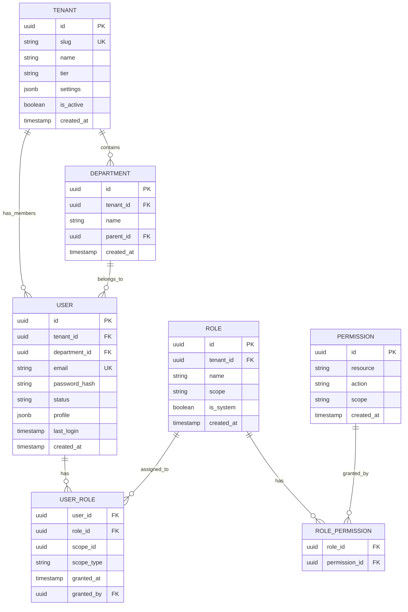
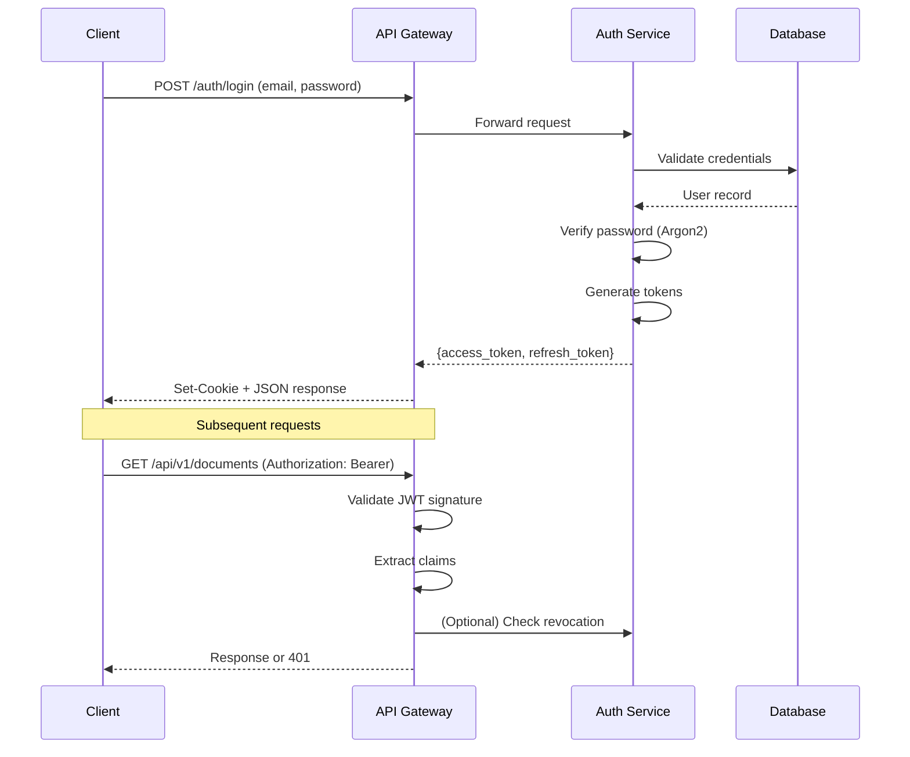
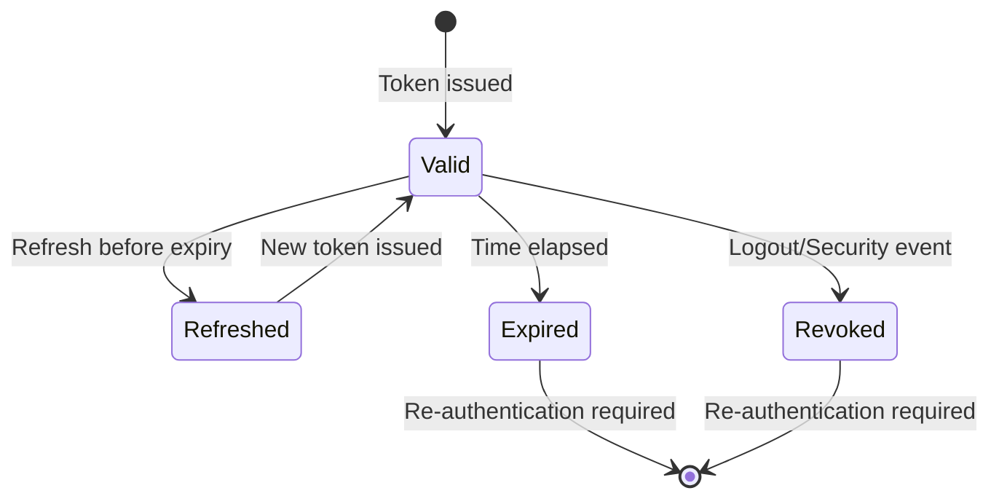
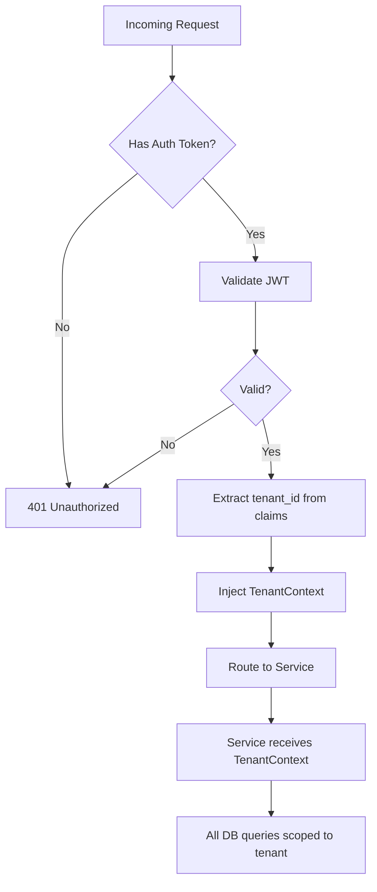

# Phase 1: Identity, Authentication & Tenant Foundation

**Document Classification:** Security Architecture Specification  
**Version:** 1.0.0  
**Status:** Implementation Ready  
**Authors:** Principal Security Architect  
**Date:** 2026-01-09

---

## Table of Contents

1. [Identity Domain Model](#1-identity-domain-model)
2. [Authentication Strategy](#2-authentication-strategy)
3. [Authorization (RBAC)](#3-authorization-rbac)
4. [Multi-Tenancy Enforcement](#4-multi-tenancy-enforcement)
5. [Identity Service Design](#5-identity-service-design)
6. [Database Schema](#6-database-schema)
7. [API Specification](#7-api-specification)
8. [Security Controls](#8-security-controls)
9. [Audit & Traceability](#9-audit--traceability)

---

## 1. Identity Domain Model

### 1.1 Entity Hierarchy



### 1.2 Entity Definitions

#### Tenant

| Field | Type | Description |
|-------|------|-------------|
| id | UUID | Primary key |
| slug | string | URL-safe unique identifier (e.g., `acme-corp`) |
| name | string | Display name |
| tier | enum | `free`, `standard`, `enterprise` |
| settings | JSONB | Tenant-specific configuration |
| is_active | boolean | Soft-disable tenant access |
| created_at | timestamp | Creation time |

**Invariants:**
- A tenant cannot be deleted; only deactivated
- All user data is scoped to exactly one tenant
- Tenant slug is immutable after creation

#### User

| Field | Type | Description |
|-------|------|-------------|
| id | UUID | Primary key |
| tenant_id | UUID | Foreign key to tenant (NOT NULL) |
| department_id | UUID | Optional department membership |
| email | string | Unique within tenant |
| password_hash | string | Argon2id hash |
| status | enum | `pending`, `active`, `suspended`, `deleted` |
| profile | JSONB | Name, avatar, preferences |
| last_login | timestamp | Last successful authentication |

**Invariants:**
- Email uniqueness is enforced per-tenant, not globally
- Password is never stored in plaintext
- Deleted users are soft-deleted (status = `deleted`)

#### Role

| Field | Type | Description |
|-------|------|-------------|
| id | UUID | Primary key |
| tenant_id | UUID | NULL for system roles, tenant_id for custom |
| name | string | Role display name |
| scope | enum | `system`, `tenant`, `department` |
| is_system | boolean | System roles cannot be modified |

**System Roles (Immutable):**

| Role | Scope | Description |
|------|-------|-------------|
| `super_admin` | system | Platform-wide administration |
| `tenant_admin` | tenant | Full tenant administration |
| `dept_admin` | department | Department administration |
| `analyst` | department | Query and view access |
| `viewer` | department | Read-only access |

#### Permission

| Field | Type | Description |
|-------|------|-------------|
| id | UUID | Primary key |
| resource | string | Resource type (e.g., `documents`, `users`) |
| action | string | Action type (e.g., `create`, `read`, `delete`) |
| scope | enum | `own`, `department`, `tenant`, `system` |

**Permission Naming Convention:**
```
{resource}:{action}:{scope}
Examples:
  documents:read:own
  documents:read:department
  users:create:tenant
  tenants:manage:system
```

### 1.3 Isolation Guarantees

| Boundary | Enforcement Mechanism |
|----------|----------------------|
| Tenant → Tenant | All queries include `WHERE tenant_id = :current_tenant` |
| Department → Department | Role scope limits data access |
| User → User | `own` scope permissions |

**Critical Rule:** No query in the system may omit tenant_id filtering except for:
- Super admin operations
- Cross-tenant system operations (explicitly audited)

---

## 2. Authentication Strategy

### 2.1 Token Architecture



### 2.2 Token Specifications

#### Access Token (JWT)

| Property | Value |
|----------|-------|
| Algorithm | RS256 (RSA + SHA-256) |
| Expiration | 15 minutes |
| Storage | Memory only (never localStorage) |

**Claims:**

```json
{
  "iss": "waqedi-auth",
  "sub": "user_uuid",
  "aud": "waqedi-api",
  "exp": 1704844800,
  "iat": 1704843900,
  "jti": "unique_token_id",
  "tenant_id": "tenant_uuid",
  "dept_id": "department_uuid",
  "roles": ["analyst"],
  "permissions": ["documents:read:department"]
}
```

#### Refresh Token

| Property | Value |
|----------|-------|
| Format | Opaque (random 256-bit) |
| Expiration | 7 days (sliding) |
| Storage | HttpOnly, Secure, SameSite=Strict cookie |
| Revocation | Token family stored in database |

### 2.3 Token Rotation Strategy



**Refresh Token Rotation:**
1. Each refresh issues a new refresh token
2. Old refresh token is immediately invalidated
3. If old token is reused → entire token family revoked (security breach detection)

### 2.4 Password Requirements

| Requirement | Specification |
|-------------|---------------|
| Minimum length | 12 characters |
| Complexity | No strict rules (NIST 800-63B compliant) |
| Breach checking | Compare against known breach databases |
| Hashing | Argon2id (memory: 64MB, iterations: 3, parallelism: 4) |

---

## 3. Authorization (RBAC)

### 3.1 Permission Resolution Algorithm

```python
def check_permission(user, resource, action, target) -> bool:
    """
    Resolve whether user can perform action on resource.
    
    Resolution order:
    1. Explicit deny (if implemented) → DENY
    2. System admin → ALLOW
    3. Role permissions → Check scope
    4. Default → DENY
    """
    # System admin bypasses all checks
    if "super_admin" in user.roles:
        return True
    
    # Get user's effective permissions
    permissions = resolve_permissions(user)
    
    # Check for matching permission
    for perm in permissions:
        if perm.resource == resource and perm.action == action:
            if check_scope(perm.scope, user, target):
                return True
    
    return False

def check_scope(scope, user, target) -> bool:
    """Validate permission scope against target."""
    if scope == "system":
        return True
    if scope == "tenant":
        return target.tenant_id == user.tenant_id
    if scope == "department":
        return target.department_id == user.department_id
    if scope == "own":
        return target.owner_id == user.id
    return False
```

### 3.2 Role Hierarchy

```
super_admin (system)
    └── tenant_admin (tenant)
            ├── dept_admin (department)
            │       ├── analyst (department)
            │       └── viewer (department)
            └── [custom roles] (tenant-defined)
```

### 3.3 Permission Matrix

| Permission | super_admin | tenant_admin | dept_admin | analyst | viewer |
|------------|:-----------:|:------------:|:----------:|:-------:|:------:|
| `tenants:manage:system` | ✓ | | | | |
| `users:create:tenant` | ✓ | ✓ | | | |
| `users:manage:department` | ✓ | ✓ | ✓ | | |
| `documents:upload:department` | ✓ | ✓ | ✓ | ✓ | |
| `documents:read:department` | ✓ | ✓ | ✓ | ✓ | ✓ |
| `documents:delete:own` | ✓ | ✓ | ✓ | ✓ | |
| `queries:execute:department` | ✓ | ✓ | ✓ | ✓ | |
| `audit:read:tenant` | ✓ | ✓ | | | |

### 3.4 Future Extensibility (ABAC)

The RBAC system is designed to evolve into Attribute-Based Access Control:

```python
# Future: Policy-based decisions
@dataclass
class PolicyContext:
    user: User
    resource: Resource
    action: str
    environment: dict  # time, IP, device, etc.

class PolicyEngine:
    def evaluate(self, context: PolicyContext) -> Decision:
        # Combine RBAC with attribute-based rules
        pass
```

---

## 4. Multi-Tenancy Enforcement

### 4.1 Enforcement Layers

| Layer | Mechanism | Failure Mode |
|-------|-----------|--------------|
| API Gateway | Tenant header extraction | 401 Unauthorized |
| Middleware | Tenant context injection | 403 Forbidden |
| Service | Tenant-scoped queries | Empty results (fail-safe) |
| Database | Row-level security (optional) | Query failure |

### 4.2 Request Flow



### 4.3 Tenant Context Implementation

```python
@dataclass(frozen=True)
class TenantContext:
    """Immutable tenant context for request lifecycle."""
    tenant_id: str
    tenant_slug: str
    tier: str
    
    def __post_init__(self):
        if not self.tenant_id:
            raise ValueError("tenant_id is required")

class TenantMiddleware:
    """Extract and inject tenant context from JWT."""
    
    async def __call__(self, request: Request, call_next):
        token = extract_token(request)
        if not token:
            raise HTTPException(401, "Authentication required")
        
        claims = validate_jwt(token)
        tenant = TenantContext(
            tenant_id=claims["tenant_id"],
            tenant_slug=claims.get("tenant_slug", ""),
            tier=claims.get("tier", "standard"),
        )
        
        # Inject into request state
        request.state.tenant = tenant
        request.state.user_id = claims["sub"]
        
        return await call_next(request)
```

### 4.4 Database Query Pattern

```python
class TenantScopedRepository:
    """All queries automatically scoped to tenant."""
    
    def __init__(self, db: Database, tenant: TenantContext):
        self.db = db
        self.tenant = tenant
    
    async def get_documents(self, filters: dict) -> list[Document]:
        # Tenant filter is ALWAYS applied
        query = """
            SELECT * FROM documents
            WHERE tenant_id = :tenant_id
            AND deleted_at IS NULL
        """
        return await self.db.fetch_all(
            query,
            {"tenant_id": self.tenant.tenant_id, **filters}
        )
```

---

## 5. Identity Service Design

### 5.1 Service Boundary

| Responsibility | In Scope | Out of Scope |
|----------------|----------|--------------|
| User CRUD | ✓ | |
| Authentication | ✓ | |
| Token management | ✓ | |
| Role/Permission CRUD | ✓ | |
| Password management | ✓ | |
| Authorization decisions | Provide data | Enforce (done at gateway/service) |
| Audit logging | Auth events | Business events |

### 5.2 Service API Overview

| Endpoint | Method | Description |
|----------|--------|-------------|
| `/auth/login` | POST | Authenticate user |
| `/auth/refresh` | POST | Refresh access token |
| `/auth/logout` | POST | Revoke tokens |
| `/auth/password/reset` | POST | Initiate password reset |
| `/users` | GET | List users (tenant-scoped) |
| `/users` | POST | Create user |
| `/users/{id}` | GET | Get user details |
| `/users/{id}` | PATCH | Update user |
| `/users/{id}/roles` | PUT | Assign roles |
| `/roles` | GET | List roles |
| `/roles` | POST | Create custom role |
| `/permissions` | GET | List permissions |

### 5.3 Internal Architecture

```
auth-service/
├── src/auth_service/
│   ├── main.py              # FastAPI app
│   ├── config.py            # Settings
│   ├── api/
│   │   ├── routes/
│   │   │   ├── auth.py      # Login, refresh, logout
│   │   │   ├── users.py     # User CRUD
│   │   │   └── roles.py     # Role management
│   │   └── schemas/         # Pydantic models
│   ├── core/
│   │   ├── security.py      # JWT, password hashing
│   │   ├── permissions.py   # Permission resolution
│   │   └── tokens.py        # Token generation
│   ├── domain/
│   │   ├── models.py        # Domain entities
│   │   └── events.py        # Auth events
│   ├── adapters/
│   │   ├── repository.py    # Database access
│   │   └── cache.py         # Redis integration
│   └── middleware/
│       ├── tenant.py        # Tenant context
│       └── rate_limit.py    # Rate limiting
└── tests/
```

---

## 6. Database Schema

### 6.1 Tables

```sql
-- Tenants
CREATE TABLE auth.tenants (
    id UUID PRIMARY KEY DEFAULT gen_random_uuid(),
    slug VARCHAR(63) NOT NULL UNIQUE,
    name VARCHAR(255) NOT NULL,
    tier VARCHAR(20) NOT NULL DEFAULT 'standard',
    settings JSONB DEFAULT '{}',
    is_active BOOLEAN NOT NULL DEFAULT true,
    created_at TIMESTAMPTZ NOT NULL DEFAULT NOW(),
    updated_at TIMESTAMPTZ NOT NULL DEFAULT NOW()
);

-- Departments
CREATE TABLE auth.departments (
    id UUID PRIMARY KEY DEFAULT gen_random_uuid(),
    tenant_id UUID NOT NULL REFERENCES auth.tenants(id),
    parent_id UUID REFERENCES auth.departments(id),
    name VARCHAR(255) NOT NULL,
    created_at TIMESTAMPTZ NOT NULL DEFAULT NOW(),
    UNIQUE(tenant_id, name)
);

-- Users
CREATE TABLE auth.users (
    id UUID PRIMARY KEY DEFAULT gen_random_uuid(),
    tenant_id UUID NOT NULL REFERENCES auth.tenants(id),
    department_id UUID REFERENCES auth.departments(id),
    email VARCHAR(255) NOT NULL,
    password_hash VARCHAR(255) NOT NULL,
    status VARCHAR(20) NOT NULL DEFAULT 'pending',
    profile JSONB DEFAULT '{}',
    last_login TIMESTAMPTZ,
    created_at TIMESTAMPTZ NOT NULL DEFAULT NOW(),
    updated_at TIMESTAMPTZ NOT NULL DEFAULT NOW(),
    UNIQUE(tenant_id, email)
);

-- Roles
CREATE TABLE auth.roles (
    id UUID PRIMARY KEY DEFAULT gen_random_uuid(),
    tenant_id UUID REFERENCES auth.tenants(id),
    name VARCHAR(100) NOT NULL,
    description TEXT,
    scope VARCHAR(20) NOT NULL DEFAULT 'tenant',
    is_system BOOLEAN NOT NULL DEFAULT false,
    created_at TIMESTAMPTZ NOT NULL DEFAULT NOW()
);

-- Permissions
CREATE TABLE auth.permissions (
    id UUID PRIMARY KEY DEFAULT gen_random_uuid(),
    resource VARCHAR(100) NOT NULL,
    action VARCHAR(50) NOT NULL,
    scope VARCHAR(20) NOT NULL,
    description TEXT,
    UNIQUE(resource, action, scope)
);

-- User-Role assignments
CREATE TABLE auth.user_roles (
    user_id UUID NOT NULL REFERENCES auth.users(id) ON DELETE CASCADE,
    role_id UUID NOT NULL REFERENCES auth.roles(id) ON DELETE CASCADE,
    scope_type VARCHAR(20),
    scope_id UUID,
    granted_at TIMESTAMPTZ NOT NULL DEFAULT NOW(),
    granted_by UUID REFERENCES auth.users(id),
    PRIMARY KEY (user_id, role_id, scope_type, scope_id)
);

-- Role-Permission mappings
CREATE TABLE auth.role_permissions (
    role_id UUID NOT NULL REFERENCES auth.roles(id) ON DELETE CASCADE,
    permission_id UUID NOT NULL REFERENCES auth.permissions(id) ON DELETE CASCADE,
    PRIMARY KEY (role_id, permission_id)
);

-- Refresh tokens
CREATE TABLE auth.refresh_tokens (
    id UUID PRIMARY KEY DEFAULT gen_random_uuid(),
    user_id UUID NOT NULL REFERENCES auth.users(id) ON DELETE CASCADE,
    token_hash VARCHAR(64) NOT NULL UNIQUE,
    family_id UUID NOT NULL,
    expires_at TIMESTAMPTZ NOT NULL,
    revoked_at TIMESTAMPTZ,
    created_at TIMESTAMPTZ NOT NULL DEFAULT NOW()
);

-- Audit log
CREATE TABLE audit.auth_events (
    id UUID PRIMARY KEY DEFAULT gen_random_uuid(),
    tenant_id UUID,
    user_id UUID,
    event_type VARCHAR(50) NOT NULL,
    event_data JSONB NOT NULL DEFAULT '{}',
    ip_address INET,
    user_agent TEXT,
    created_at TIMESTAMPTZ NOT NULL DEFAULT NOW()
);
```

### 6.2 Indexes

```sql
-- Performance indexes
CREATE INDEX idx_users_tenant_email ON auth.users(tenant_id, email);
CREATE INDEX idx_users_status ON auth.users(status) WHERE status != 'deleted';
CREATE INDEX idx_user_roles_user ON auth.user_roles(user_id);
CREATE INDEX idx_refresh_tokens_user ON auth.refresh_tokens(user_id) WHERE revoked_at IS NULL;
CREATE INDEX idx_refresh_tokens_family ON auth.refresh_tokens(family_id);
CREATE INDEX idx_audit_tenant_time ON audit.auth_events(tenant_id, created_at DESC);
CREATE INDEX idx_audit_user_time ON audit.auth_events(user_id, created_at DESC);
```

---

## 7. API Specification

### 7.1 Authentication Endpoints

#### POST /api/v1/auth/login

**Request:**
```json
{
  "email": "user@example.com",
  "password": "secure_password"
}
```

**Response (200):**
```json
{
  "access_token": "eyJhbGciOiJSUzI1NiIs...",
  "token_type": "bearer",
  "expires_in": 900
}
```

**Response Headers:**
```
Set-Cookie: refresh_token=<opaque>; HttpOnly; Secure; SameSite=Strict; Path=/api/v1/auth
```

**Error Responses:**
- `401`: Invalid credentials
- `403`: Account suspended
- `429`: Rate limit exceeded

#### POST /api/v1/auth/refresh

**Request:** Cookie-based (no body)

**Response (200):**
```json
{
  "access_token": "eyJhbGciOiJSUzI1NiIs...",
  "token_type": "bearer",
  "expires_in": 900
}
```

#### POST /api/v1/auth/logout

**Response (204):** No content

### 7.2 User Management Endpoints

#### GET /api/v1/users

**Query Parameters:**
- `page` (int): Page number
- `limit` (int): Items per page (max 100)
- `status` (string): Filter by status
- `department_id` (uuid): Filter by department

**Response (200):**
```json
{
  "items": [
    {
      "id": "uuid",
      "email": "user@example.com",
      "status": "active",
      "profile": {"name": "John Doe"},
      "department_id": "uuid",
      "created_at": "2026-01-09T00:00:00Z"
    }
  ],
  "total": 50,
  "page": 1,
  "limit": 20
}
```

#### POST /api/v1/users

**Request:**
```json
{
  "email": "newuser@example.com",
  "password": "secure_password",
  "department_id": "uuid",
  "profile": {"name": "New User"},
  "roles": ["analyst"]
}
```

### 7.3 Error Response Format (RFC 7807)

```json
{
  "type": "urn:waqedi:error:authentication-failed",
  "title": "Authentication Failed",
  "status": 401,
  "detail": "Invalid email or password",
  "instance": "/api/v1/auth/login"
}
```

---

## 8. Security Controls

### 8.1 Rate Limiting

| Endpoint | Limit | Window |
|----------|-------|--------|
| `/auth/login` | 5 attempts | 15 minutes |
| `/auth/refresh` | 10 requests | 1 minute |
| `/auth/password/reset` | 3 requests | 1 hour |
| All other endpoints | 100 requests | 1 minute |

### 8.2 Secret Management

| Secret | Storage | Rotation |
|--------|---------|----------|
| JWT signing keys | Vault / HSM | 90 days |
| Database credentials | Vault | 30 days |
| API keys | Encrypted in DB | On-demand |

### 8.3 Replay Attack Prevention

1. **JTI (JWT ID):** Each access token has unique ID
2. **Short expiration:** 15-minute access tokens
3. **Token binding:** Refresh tokens bound to user-agent fingerprint
4. **One-time refresh:** Tokens invalidated after use

---

## 9. Audit & Traceability

### 9.1 Audited Events

| Event | Data Captured |
|-------|---------------|
| `auth.login.success` | user_id, tenant_id, ip, user_agent |
| `auth.login.failure` | email, ip, reason |
| `auth.logout` | user_id, token_family |
| `auth.token.refresh` | user_id, token_family |
| `auth.password.change` | user_id, changed_by |
| `user.created` | user_id, created_by |
| `user.role.assigned` | user_id, role_id, granted_by |
| `permission.denied` | user_id, resource, action |

### 9.2 Log Format

```json
{
  "timestamp": "2026-01-09T00:14:43Z",
  "event_type": "auth.login.success",
  "tenant_id": "uuid",
  "user_id": "uuid",
  "correlation_id": "uuid",
  "ip_address": "192.168.1.100",
  "user_agent": "Mozilla/5.0...",
  "data": {}
}
```

---

## Document Control

| Version | Date | Author | Changes |
|---------|------|--------|---------|
| 1.0.0 | 2026-01-09 | Security Architect | Initial specification |
