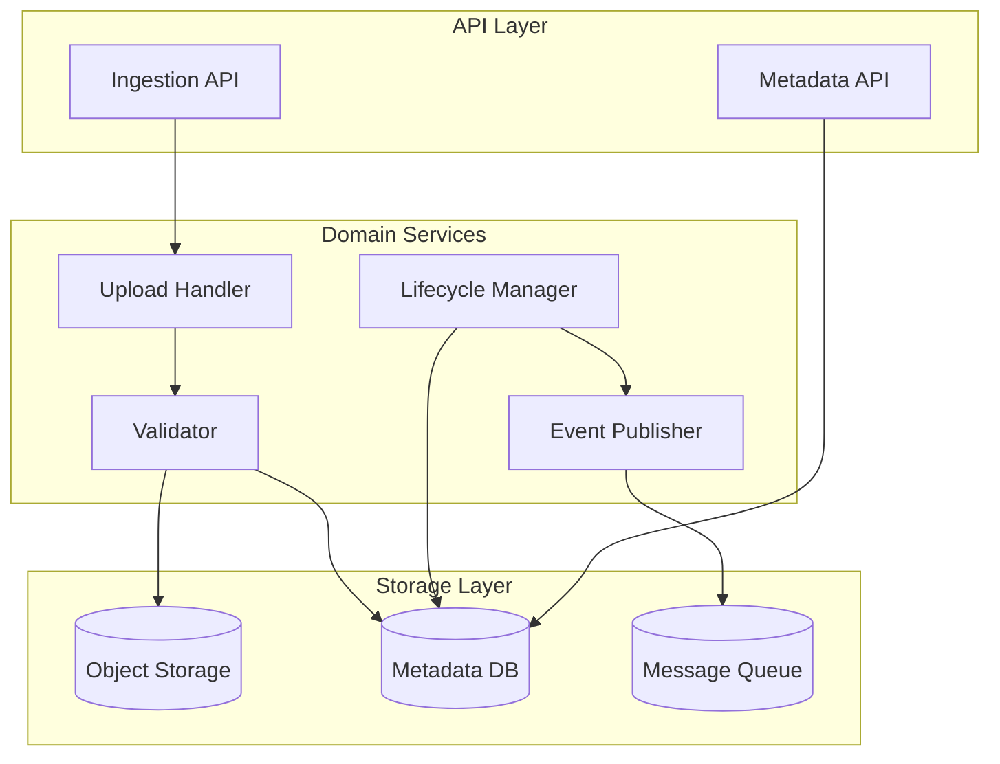
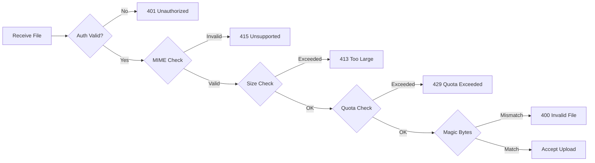
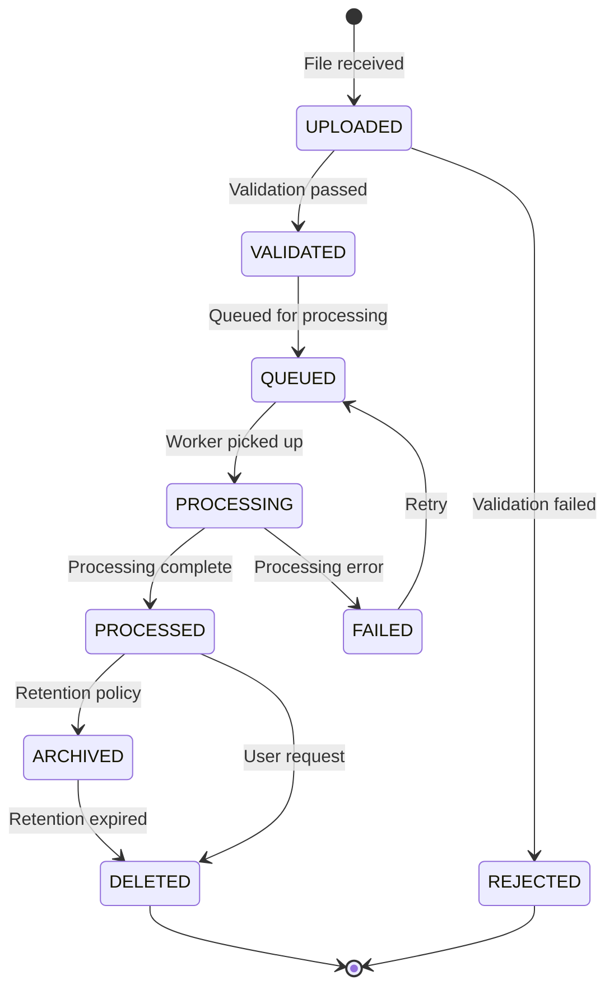

# Phase 2: File Ingestion, Document Lifecycle & Data Governance

**Document Classification:** Infrastructure Architecture Specification  
**Version:** 1.0.0  
**Status:** Implementation Ready  
**Authors:** Principal Platform Architect  
**Date:** 2026-01-09

---

## Table of Contents

1. [System Overview](#1-system-overview)
2. [File Ingestion Service](#2-file-ingestion-service)
3. [Object Storage Abstraction](#3-object-storage-abstraction)
4. [Document Metadata Model](#4-document-metadata-model)
5. [Document Lifecycle State Machine](#5-document-lifecycle-state-machine)
6. [Event & Job Dispatching](#6-event--job-dispatching)
7. [Data Governance](#7-data-governance)
8. [API Specification](#8-api-specification)
9. [Database Schema](#9-database-schema)
10. [Security Controls](#10-security-controls)

---

## 1. System Overview

### 1.1 Purpose

This subsystem is the **single source of truth** for all documents entering the AI platform. It provides:

- Secure ingestion of heterogeneous file types
- Immutable storage with tenant isolation
- Canonical metadata management
- Explicit lifecycle state control
- Event-driven downstream notification

### 1.2 Scope Boundaries

| In Scope | Out of Scope |
|----------|--------------|
| File upload & validation | OCR / text extraction |
| Storage abstraction | Embedding generation |
| Metadata management | LLM processing |
| Lifecycle states | Content transformation |
| Event publishing | AI pipeline execution |

### 1.3 Service Architecture



---

## 2. File Ingestion Service

### 2.1 Supported File Types

| Category | Extensions | MIME Types | Max Size |
|----------|------------|------------|----------|
| Documents | `.pdf` | `application/pdf` | 100 MB |
| Images | `.png`, `.jpg`, `.jpeg` | `image/png`, `image/jpeg` | 50 MB |
| Audio | `.mp3`, `.wav` | `audio/mpeg`, `audio/wav` | 500 MB |
| Video | `.mp4` | `video/mp4` | 2 GB |

### 2.2 Validation Pipeline



### 2.3 Upload Flow

1. **Receive** - Multipart upload with streaming
2. **Authenticate** - Validate JWT, extract tenant context
3. **Validate** - MIME type, size, magic bytes
4. **Generate ID** - Immutable document ID (UUID v7 for time-ordering)
5. **Store** - Write to object storage with tenant path
6. **Record** - Create metadata record with UPLOADED state
7. **Publish** - Emit `document.uploaded` event
8. **Respond** - Return document ID and upload status

### 2.4 Document Identifier Format

```
doc_{timestamp}_{random}
Example: doc_01HQGX5K8M3N4P7R9S2T_a7b3c9d1e5f2
```

- UUID v7 base for time-ordering
- Prefix for human readability
- Globally unique across all tenants

---

## 3. Object Storage Abstraction

### 3.1 Storage Interface

```python
class ObjectStoragePort(Protocol):
    """Abstract interface for object storage operations."""
    
    async def put_object(
        self,
        bucket: str,
        key: str,
        data: AsyncIterable[bytes],
        content_type: str,
        metadata: dict[str, str],
    ) -> StorageResult: ...
    
    async def get_object(
        self,
        bucket: str,
        key: str,
    ) -> AsyncIterable[bytes]: ...
    
    async def delete_object(
        self,
        bucket: str,
        key: str,
    ) -> None: ...
    
    async def generate_presigned_url(
        self,
        bucket: str,
        key: str,
        expires_in: int,
    ) -> str: ...
```

### 3.2 Tenant Isolation Strategy

**Path-Based Isolation:**

```
bucket: waqedi-documents
path:   /{tenant_id}/{year}/{month}/{document_id}/{filename}

Example:
/tenant_abc123/2026/01/doc_01HQGX5K8M3N4P7R9S2T/original.pdf
```

**Enforcement:**
- All storage operations require tenant context
- Path construction validated at abstraction layer
- No direct cross-tenant path access possible

### 3.3 Storage Properties

| Property | Requirement |
|----------|-------------|
| Immutability | Files never modified after upload |
| Encryption | AES-256 at rest |
| Redundancy | Configurable replication |
| Versioning | Disabled (immutable model) |

---

## 4. Document Metadata Model

### 4.1 Canonical Schema

```python
@dataclass
class DocumentMetadata:
    # Identity
    id: str                      # doc_xxx unique identifier
    tenant_id: UUID              # Owning tenant
    
    # Ownership
    uploaded_by: UUID            # User who uploaded
    department_id: UUID | None   # Optional department scope
    collection_id: UUID | None   # Optional collection
    
    # File Properties
    filename: str                # Original filename
    content_type: str            # MIME type
    size_bytes: int              # File size
    checksum_sha256: str         # Content hash
    
    # Classification
    file_category: FileCategory  # DOCUMENT, IMAGE, AUDIO, VIDEO
    language: str | None         # ISO 639-1 (if detected)
    
    # Lifecycle
    status: DocumentStatus       # Current state
    retention_policy: str        # Policy identifier
    legal_hold: bool            # Prevents deletion
    
    # Timestamps
    uploaded_at: datetime
    validated_at: datetime | None
    processed_at: datetime | None
    archived_at: datetime | None
    deleted_at: datetime | None
    expires_at: datetime | None
    
    # Storage Reference (internal)
    storage_bucket: str
    storage_key: str
```

### 4.2 File Categories

| Category | Processing Pipeline |
|----------|-------------------|
| `DOCUMENT` | PDF → OCR → Chunking → Embedding |
| `IMAGE` | Vision analysis → Captioning |
| `AUDIO` | Speech-to-text → Chunking |
| `VIDEO` | Frame extraction + Audio → Combined |

---

## 5. Document Lifecycle State Machine

### 5.1 States



### 5.2 State Definitions

| State | Description | Allowed Transitions |
|-------|-------------|-------------------|
| `UPLOADED` | File received, awaiting validation | VALIDATED, REJECTED |
| `VALIDATED` | Passed all checks, ready for queue | QUEUED |
| `QUEUED` | In processing queue | PROCESSING |
| `PROCESSING` | Being processed by worker | PROCESSED, FAILED |
| `PROCESSED` | Successfully processed | ARCHIVED, DELETED |
| `FAILED` | Processing failed | QUEUED (retry) |
| `ARCHIVED` | Moved to cold storage | DELETED |
| `REJECTED` | Validation failed | (terminal) |
| `DELETED` | Logically deleted | (terminal) |

### 5.3 Transition Rules

```python
ALLOWED_TRANSITIONS = {
    DocumentStatus.UPLOADED: {DocumentStatus.VALIDATED, DocumentStatus.REJECTED},
    DocumentStatus.VALIDATED: {DocumentStatus.QUEUED},
    DocumentStatus.QUEUED: {DocumentStatus.PROCESSING},
    DocumentStatus.PROCESSING: {DocumentStatus.PROCESSED, DocumentStatus.FAILED},
    DocumentStatus.PROCESSED: {DocumentStatus.ARCHIVED, DocumentStatus.DELETED},
    DocumentStatus.FAILED: {DocumentStatus.QUEUED},
    DocumentStatus.ARCHIVED: {DocumentStatus.DELETED},
}

def transition(doc: Document, new_status: DocumentStatus) -> None:
    if new_status not in ALLOWED_TRANSITIONS.get(doc.status, set()):
        raise IllegalStateTransition(doc.status, new_status)
    
    if doc.legal_hold and new_status == DocumentStatus.DELETED:
        raise LegalHoldViolation(doc.id)
    
    # Atomic update with audit
    update_status_with_audit(doc, new_status)
```

---

## 6. Event & Job Dispatching

### 6.1 Event Types

| Event | Trigger | Payload |
|-------|---------|---------|
| `document.uploaded` | File stored | doc_id, tenant_id, file_category |
| `document.validated` | Validation passed | doc_id, tenant_id |
| `document.queued` | Added to processing queue | doc_id, priority |
| `document.processed` | Processing complete | doc_id, chunks_count |
| `document.failed` | Processing failed | doc_id, error_code |
| `document.deleted` | Soft delete | doc_id, deleted_by |

### 6.2 Event Schema

```json
{
  "event_id": "evt_01HQGX5K8M3N4P7R9S2T",
  "event_type": "document.uploaded",
  "timestamp": "2026-01-09T00:40:57Z",
  "tenant_id": "tenant_abc123",
  "correlation_id": "req_xyz789",
  "payload": {
    "document_id": "doc_01HQGX5K8M3N4P7R9S2T",
    "file_category": "DOCUMENT",
    "content_type": "application/pdf",
    "size_bytes": 1048576
  }
}
```

### 6.3 Delivery Guarantees

| Property | Implementation |
|----------|----------------|
| Delivery | At-least-once via Kafka |
| Ordering | Per-document (partition by doc_id) |
| Idempotency | Event ID for deduplication |
| Retry | Exponential backoff, DLQ after 3 failures |

---

## 7. Data Governance

### 7.1 Retention Policies

| Policy ID | Retention Period | Auto-Archive | Auto-Delete |
|-----------|-----------------|--------------|-------------|
| `standard` | 2 years | After 6 months | After 2 years |
| `extended` | 7 years | After 1 year | After 7 years |
| `legal` | Indefinite | Never | Manual only |
| `temporary` | 30 days | Never | After 30 days |

### 7.2 Legal Hold

```python
async def apply_legal_hold(doc_id: str, reason: str, applied_by: UUID) -> None:
    """Apply legal hold, preventing deletion."""
    doc = await get_document(doc_id)
    doc.legal_hold = True
    
    await audit_log(
        event="document.legal_hold.applied",
        doc_id=doc_id,
        reason=reason,
        applied_by=applied_by,
    )

async def remove_legal_hold(doc_id: str, authorization: str, removed_by: UUID) -> None:
    """Remove legal hold with explicit authorization."""
    # Requires elevated permission
    if not has_permission(removed_by, "documents:legal_hold:remove"):
        raise AuthorizationError()
    
    doc = await get_document(doc_id)
    doc.legal_hold = False
    
    await audit_log(
        event="document.legal_hold.removed",
        doc_id=doc_id,
        authorization=authorization,
        removed_by=removed_by,
    )
```

### 7.3 Deletion Semantics

| Action | Metadata | Storage | Recovery |
|--------|----------|---------|----------|
| Soft Delete | `deleted_at` set | Retained | Possible within 30 days |
| Hard Delete | Removed | Removed | Not possible |
| Expiry Delete | Removed | Removed | Not possible |

**Hard delete requirements:**
- Legal hold removed
- 30-day waiting period
- Admin authorization
- Audit record preserved

---

## 8. API Specification

### 8.1 Upload Endpoint

**POST /api/v1/documents**

```
Content-Type: multipart/form-data
Authorization: Bearer <token>
```

**Request:**
- `file`: Binary file content
- `collection_id`: Optional collection
- `metadata`: Optional JSON with custom fields

**Response (201):**
```json
{
  "document_id": "doc_01HQGX5K8M3N4P7R9S2T",
  "status": "UPLOADED",
  "filename": "report.pdf",
  "content_type": "application/pdf",
  "size_bytes": 1048576,
  "uploaded_at": "2026-01-09T00:40:57Z"
}
```

**Errors:**
- `401`: Unauthorized
- `413`: File too large
- `415`: Unsupported media type
- `429`: Quota exceeded

### 8.2 List Documents

**GET /api/v1/documents**

**Query Parameters:**
- `status`: Filter by status
- `file_category`: Filter by category
- `collection_id`: Filter by collection
- `uploaded_after`: Date filter
- `limit`, `cursor`: Pagination

**Response (200):**
```json
{
  "items": [...],
  "next_cursor": "...",
  "total_count": 150
}
```

### 8.3 Get Document

**GET /api/v1/documents/{document_id}**

**Response (200):**
```json
{
  "document_id": "doc_01HQGX5K8M3N4P7R9S2T",
  "filename": "report.pdf",
  "content_type": "application/pdf",
  "size_bytes": 1048576,
  "status": "PROCESSED",
  "file_category": "DOCUMENT",
  "uploaded_by": "user_uuid",
  "uploaded_at": "2026-01-09T00:40:57Z",
  "processed_at": "2026-01-09T00:45:00Z"
}
```

### 8.4 Delete Document

**DELETE /api/v1/documents/{document_id}**

**Response (202):** Deletion accepted (soft delete)

**Response (409):** Legal hold prevents deletion

---

## 9. Database Schema

```sql
CREATE TABLE documents.documents (
    id VARCHAR(50) PRIMARY KEY,
    tenant_id UUID NOT NULL,
    uploaded_by UUID NOT NULL,
    department_id UUID,
    collection_id UUID,
    
    filename VARCHAR(255) NOT NULL,
    content_type VARCHAR(100) NOT NULL,
    size_bytes BIGINT NOT NULL,
    checksum_sha256 VARCHAR(64) NOT NULL,
    
    file_category VARCHAR(20) NOT NULL,
    language VARCHAR(10),
    
    status VARCHAR(20) NOT NULL DEFAULT 'UPLOADED',
    retention_policy VARCHAR(50) NOT NULL DEFAULT 'standard',
    legal_hold BOOLEAN NOT NULL DEFAULT false,
    
    storage_bucket VARCHAR(100) NOT NULL,
    storage_key VARCHAR(500) NOT NULL,
    
    uploaded_at TIMESTAMPTZ NOT NULL DEFAULT NOW(),
    validated_at TIMESTAMPTZ,
    processed_at TIMESTAMPTZ,
    archived_at TIMESTAMPTZ,
    deleted_at TIMESTAMPTZ,
    expires_at TIMESTAMPTZ,
    
    metadata JSONB DEFAULT '{}'
);

CREATE INDEX idx_documents_tenant ON documents.documents(tenant_id);
CREATE INDEX idx_documents_status ON documents.documents(status);
CREATE INDEX idx_documents_tenant_status ON documents.documents(tenant_id, status);
CREATE INDEX idx_documents_collection ON documents.documents(collection_id);
CREATE INDEX idx_documents_uploaded_at ON documents.documents(uploaded_at DESC);
```

---

## 10. Security Controls

### 10.1 Input Validation

| Check | Implementation |
|-------|----------------|
| MIME type | Content-Type header + magic bytes |
| File size | Streaming size check, reject early |
| Filename | Sanitize, remove path components |
| Content | Malware scan hook (async) |

### 10.2 Rate Limits

| Endpoint | Limit | Window |
|----------|-------|--------|
| POST /documents | 10 uploads | 1 minute |
| GET /documents | 100 requests | 1 minute |
| DELETE /documents | 5 requests | 1 minute |

### 10.3 Audit Events

| Event | Logged Data |
|-------|-------------|
| `document.upload.started` | tenant, user, filename, size |
| `document.upload.completed` | doc_id, storage_key |
| `document.status.changed` | doc_id, old_status, new_status |
| `document.accessed` | doc_id, accessor |
| `document.deleted` | doc_id, deleted_by, reason |

---

## Document Control

| Version | Date | Author | Changes |
|---------|------|--------|---------|
| 1.0.0 | 2026-01-09 | Platform Architect | Initial specification |
