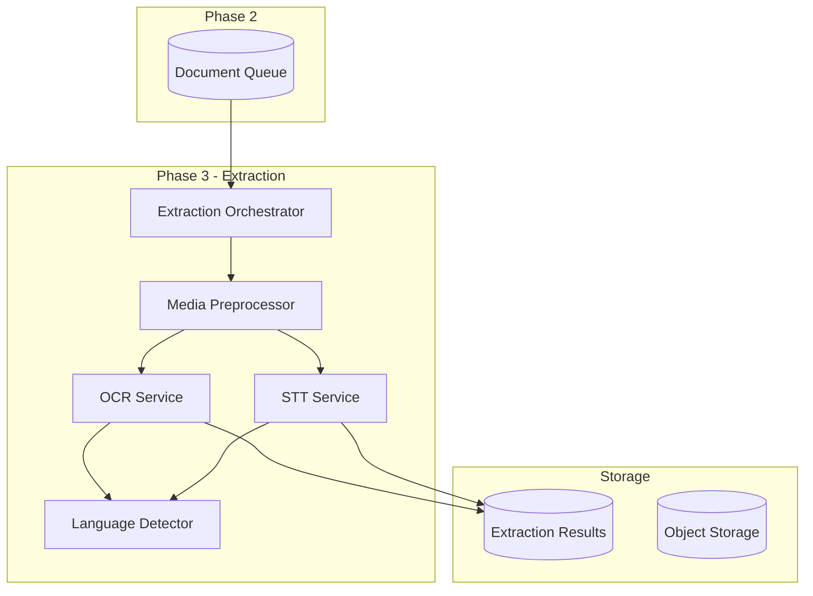
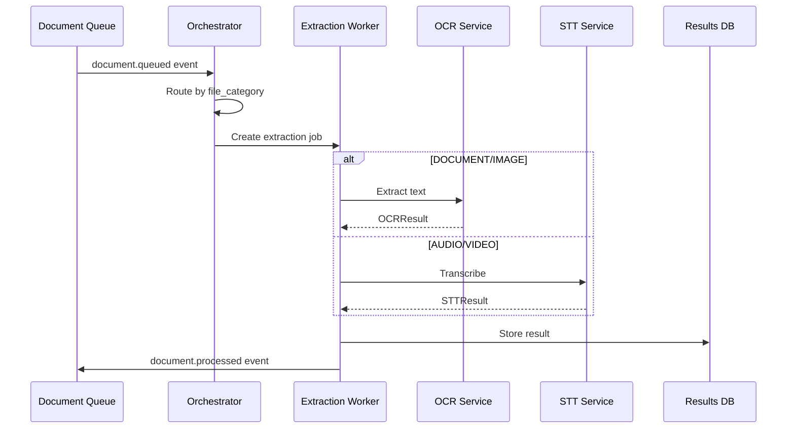

# Phase 3: OCR & Speech Intelligence (Multimodal Text Extraction)

**Document Classification:** AI Systems Architecture Specification  
**Version:** 1.0.0  
**Status:** Implementation Ready  
**Authors:** Principal AI Systems Architect  
**Date:** 2026-01-09

---

## Table of Contents

1. [System Overview](#1-system-overview)
2. [OCR Service](#2-ocr-service)
3. [Speech-to-Text Service](#3-speech-to-text-service)
4. [Media Preprocessing](#4-media-preprocessing)
5. [Language Detection](#5-language-detection)
6. [Data Models](#6-data-models)
7. [Processing Orchestration](#7-processing-orchestration)
8. [Database Schema](#8-database-schema)
9. [Observability](#9-observability)

---

## 1. System Overview

### 1.1 Purpose

Convert non-textual enterprise data (images, scanned PDFs, audio, video) into machine-readable, traceable text with preserved spatial/temporal context and confidence scoring.

### 1.2 Scope Boundaries

| In Scope | Out of Scope |
|----------|--------------|
| OCR (images, scanned PDFs) | Translation |
| Speech-to-Text (audio, video) | Chunking |
| Language detection | Embeddings |
| Confidence tracking | LLM inference |
| Bounding boxes / timestamps | Semantic analysis |

### 1.3 Service Architecture



---

## 2. OCR Service

### 2.1 Responsibilities

- Extract text from images and scanned PDFs
- Preserve layout with bounding boxes
- Support RTL (Arabic) and LTR (English, Turkish) scripts
- Provide confidence scores at word/block level

### 2.2 Model Adapters

**Primary: EasyOCR**
- Multilingual support (80+ languages)
- GPU acceleration
- Good Arabic/Turkish support

**Fallback: Tesseract**
- Battle-tested reliability
- No GPU required

```python
class OCRModelAdapter(Protocol):
    """Abstract interface for OCR models."""
    
    async def extract(
        self,
        image: bytes,
        languages: list[str],
    ) -> OCRResult: ...
    
    def supported_languages(self) -> list[str]: ...
```

### 2.3 Output Schema

```python
@dataclass
class BoundingBox:
    x: int
    y: int
    width: int
    height: int

@dataclass
class TextBlock:
    text: str
    confidence: float  # 0.0 - 1.0
    bounding_box: BoundingBox
    block_type: str  # "word", "line", "paragraph"

@dataclass
class OCRPageResult:
    page_number: int
    blocks: list[TextBlock]
    full_text: str
    mean_confidence: float
    detected_language: str | None

@dataclass
class OCRResult:
    document_id: str
    pages: list[OCRPageResult]
    total_pages: int
    processing_time_ms: int
    model_version: str
```

### 2.4 Language Support

| Language | Code | Script |
|----------|------|--------|
| English | `en` | LTR |
| Arabic | `ar` | RTL |
| Turkish | `tr` | LTR |

---

## 3. Speech-to-Text Service

### 3.1 Responsibilities

- Transcribe audio from MP3, WAV, MP4
- Preserve word-level timestamps
- Detect spoken language
- Handle long-duration recordings (chunked processing)

### 3.2 Model Adapter

**Primary: OpenAI Whisper (local)**
- State-of-the-art accuracy
- Multilingual
- Word-level timestamps

```python
class STTModelAdapter(Protocol):
    """Abstract interface for STT models."""
    
    async def transcribe(
        self,
        audio_path: Path,
        language: str | None = None,
    ) -> STTResult: ...
    
    def supported_languages(self) -> list[str]: ...
```

### 3.3 Output Schema

```python
@dataclass
class TranscriptSegment:
    text: str
    start_time: float  # seconds
    end_time: float
    confidence: float | None
    speaker_id: str | None  # for diarization

@dataclass
class STTResult:
    document_id: str
    segments: list[TranscriptSegment]
    full_text: str
    duration_seconds: float
    detected_language: str
    processing_time_ms: int
    model_version: str
```

### 3.4 Long Audio Handling

| Duration | Strategy |
|----------|----------|
| < 30 min | Single pass |
| 30-120 min | Chunked (10 min segments) |
| > 120 min | Parallel chunks |

---

## 4. Media Preprocessing

### 4.1 Image Preprocessing

```python
class ImagePreprocessor:
    """Prepare images for OCR."""
    
    def preprocess(self, image: bytes) -> bytes:
        # 1. Convert to grayscale
        # 2. Deskew
        # 3. Remove noise
        # 4. Binarize (if scanned)
        # 5. Resize if too large
        pass
```

### 4.2 Audio Preprocessing

```python
class AudioPreprocessor:
    """Prepare audio for STT."""
    
    async def preprocess(self, input_path: Path) -> Path:
        # 1. Extract audio from video (if MP4)
        # 2. Convert to WAV 16kHz mono
        # 3. Normalize volume
        # 4. Remove silence (optional)
        pass
```

### 4.3 PDF Handling

```python
class PDFProcessor:
    """Handle PDF documents."""
    
    async def extract_pages(self, pdf_bytes: bytes) -> list[bytes]:
        """Convert PDF pages to images for OCR."""
        pass
    
    def is_scanned(self, pdf_bytes: bytes) -> bool:
        """Detect if PDF is scanned vs native text."""
        pass
```

---

## 5. Language Detection

### 5.1 Lightweight Detection

Uses `langdetect` or `fasttext` for:
- Tagging extracted text segments
- Routing to language-specific processing

```python
class LanguageDetector:
    """Detect language from text."""
    
    def detect(self, text: str) -> LanguageResult:
        pass

@dataclass
class LanguageResult:
    language: str  # ISO 639-1
    confidence: float
    script: str  # "latin", "arabic", etc.
```

---

## 6. Data Models

### 6.1 Extraction Job

```python
@dataclass
class ExtractionJob:
    id: str
    document_id: str
    tenant_id: UUID
    job_type: str  # "ocr", "stt"
    status: str  # "pending", "running", "completed", "failed"
    attempts: int
    max_attempts: int = 3
    created_at: datetime
    started_at: datetime | None
    completed_at: datetime | None
    error_message: str | None
```

### 6.2 Extraction Result

```python
@dataclass
class ExtractionResult:
    id: str
    document_id: str
    tenant_id: UUID
    extraction_type: str  # "ocr", "stt"
    result_data: dict  # JSON serialized OCRResult/STTResult
    model_version: str
    processing_time_ms: int
    mean_confidence: float
    detected_language: str
    created_at: datetime
```

---

## 7. Processing Orchestration

### 7.1 Job Flow



### 7.2 Retry Strategy

| Attempt | Delay | Action |
|---------|-------|--------|
| 1 | Immediate | First try |
| 2 | 30 seconds | Retry with cleanup |
| 3 | 5 minutes | Final retry |
| Failed | - | Move to DLQ, flag for review |

### 7.3 Idempotency

- Each job has unique ID
- Results keyed by (document_id, extraction_type)
- Reprocessing overwrites previous result

---

## 8. Database Schema

```sql
-- Extraction jobs
CREATE TABLE extraction.jobs (
    id UUID PRIMARY KEY DEFAULT gen_random_uuid(),
    document_id VARCHAR(50) NOT NULL,
    tenant_id UUID NOT NULL,
    job_type VARCHAR(20) NOT NULL CHECK (job_type IN ('ocr', 'stt')),
    status VARCHAR(20) NOT NULL DEFAULT 'pending',
    attempts INT NOT NULL DEFAULT 0,
    max_attempts INT NOT NULL DEFAULT 3,
    error_message TEXT,
    created_at TIMESTAMPTZ NOT NULL DEFAULT NOW(),
    started_at TIMESTAMPTZ,
    completed_at TIMESTAMPTZ
);

-- Extraction results
CREATE TABLE extraction.results (
    id UUID PRIMARY KEY DEFAULT gen_random_uuid(),
    document_id VARCHAR(50) NOT NULL UNIQUE,
    tenant_id UUID NOT NULL,
    extraction_type VARCHAR(20) NOT NULL,
    result_data JSONB NOT NULL,
    model_version VARCHAR(50) NOT NULL,
    processing_time_ms INT NOT NULL,
    mean_confidence FLOAT,
    detected_language VARCHAR(10),
    created_at TIMESTAMPTZ NOT NULL DEFAULT NOW()
);

CREATE INDEX idx_jobs_document ON extraction.jobs(document_id);
CREATE INDEX idx_jobs_status ON extraction.jobs(status);
CREATE INDEX idx_results_tenant ON extraction.results(tenant_id);
```

---

## 9. Observability

### 9.1 Metrics

| Metric | Type | Description |
|--------|------|-------------|
| `extraction_jobs_total` | Counter | Jobs by type and status |
| `extraction_duration_seconds` | Histogram | Processing time |
| `extraction_confidence` | Histogram | Confidence distribution |
| `extraction_failures_total` | Counter | Failures by error type |

### 9.2 Audit Events

| Event | Data |
|-------|------|
| `extraction.job.started` | document_id, job_type, model_version |
| `extraction.job.completed` | document_id, duration, confidence |
| `extraction.job.failed` | document_id, error_code, attempts |

---

## Document Control

| Version | Date | Author | Changes |
|---------|------|--------|---------|
| 1.0.0 | 2026-01-09 | AI Systems Architect | Initial specification |
