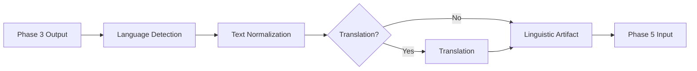
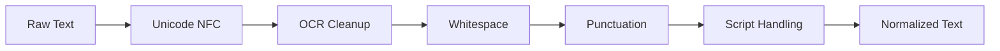
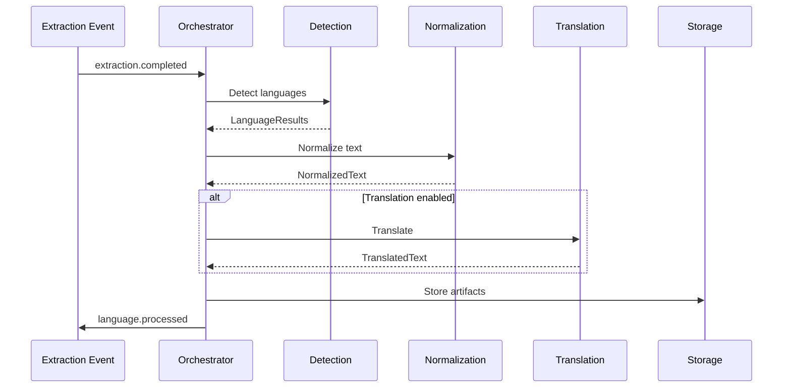

# Phase 4: Language Normalization & Multilingual Intelligence

**Document Classification:** Language Systems Architecture Specification  
**Version:** 1.0.0  
**Status:** Implementation Ready  
**Authors:** Principal Language Systems Architect  
**Date:** 2026-01-09

---

## Table of Contents

1. [System Overview](#1-system-overview)
2. [Language Detection Service](#2-language-detection-service)
3. [Text Normalization Service](#3-text-normalization-service)
4. [Translation Strategy Layer](#4-translation-strategy-layer)
5. [Linguistic Metadata](#5-linguistic-metadata)
6. [Data Models](#6-data-models)
7. [Processing Orchestration](#7-processing-orchestration)
8. [Database Schema](#8-database-schema)
9. [Observability](#9-observability)

---

## 1. System Overview

### 1.1 Purpose

Convert raw, multilingual, noisy text from OCR/STT into normalized, linguistically consistent artifacts for downstream AI processing. This phase establishes the **linguistic contract** of the platform.

### 1.2 Scope Boundaries

| In Scope | Out of Scope |
|----------|--------------|
| Language detection | Semantic chunking |
| Text normalization | Embedding generation |
| Optional translation | LLM inference |
| Metadata enrichment | Retrieval logic |

### 1.3 Processing Pipeline



---

## 2. Language Detection Service

### 2.1 Detection Granularities

| Level | Purpose | Threshold |
|-------|---------|-----------|
| Document | Overall language classification | 0.7 |
| Page | Per-page detection (PDFs) | 0.6 |
| Segment | Paragraph/sentence level | 0.5 |

### 2.2 Multi-Language Handling

```python
@dataclass
class LanguageDetectionResult:
    primary_language: str  # ISO 639-1
    confidence: float  # 0.0 - 1.0
    secondary_languages: list[tuple[str, float]]  # [(lang, conf), ...]
    is_mixed: bool
    script: str  # "latin", "arabic", "mixed"
```

### 2.3 Engine Abstraction

```python
class LanguageDetector(Protocol):
    """Abstract interface for language detection engines."""
    
    def detect(self, text: str) -> LanguageDetectionResult: ...
    def detect_segments(self, segments: list[str]) -> list[LanguageDetectionResult]: ...
```

**Primary: langdetect + fasttext hybrid**
- langdetect for short text (< 50 chars)
- fasttext for longer content (higher accuracy)

---

## 3. Text Normalization Service

### 3.1 Normalization Pipeline



### 3.2 Normalization Steps

| Step | Description | Reversible |
|------|-------------|------------|
| Unicode NFC | Canonical composition | Yes |
| OCR Cleanup | Fix common OCR errors | Logged |
| Whitespace | Normalize spaces, newlines | Yes |
| Punctuation | Standardize quotes, dashes | Logged |
| Script | RTL markers, direction | Yes |

### 3.3 Language-Aware Rules

```python
NORMALIZATION_RULES = {
    "ar": {
        "remove_diacritics": False,  # Keep tashkeel by default
        "normalize_alef": True,      # ا أ إ آ → ا
        "normalize_yeh": True,       # ى → ي
    },
    "tr": {
        "preserve_dotted_i": True,   # İ/ı distinction
    },
    "en": {
        "smart_quotes": True,        # "" → ""
        "ligatures": True,           # fi → fi
    },
}
```

### 3.4 Normalization Record

```python
@dataclass
class NormalizationRecord:
    original_text: str
    normalized_text: str
    changes: list[NormalizationChange]
    version: str  # Normalizer version
    language: str
    
@dataclass
class NormalizationChange:
    position: int
    original: str
    replacement: str
    rule: str
```

---

## 4. Translation Strategy Layer

### 4.1 Strategy Definitions

| Strategy | Description | Use Case |
|----------|-------------|----------|
| **Native** | Process in original language | Multilingual enterprise |
| **Canonical** | Translate to single language | English-first systems |
| **Hybrid** | Translate on-demand | Query-time translation |

### 4.2 Tenant Configuration

```python
@dataclass
class TranslationConfig:
    strategy: str  # "native", "canonical", "hybrid"
    canonical_language: str  # "en" if canonical
    translate_on_ingest: bool
    preserve_original: bool  # Always True
    translation_engine: str  # "google", "azure", "deepl"
```

### 4.3 Translation Record

```python
@dataclass
class TranslationResult:
    source_language: str
    target_language: str
    source_text: str
    translated_text: str
    engine: str
    engine_version: str
    confidence: float | None
    timestamp: datetime
```

### 4.4 Translation Lineage

Every translation maintains full provenance:

```json
{
  "document_id": "doc_xxx",
  "original_text_id": "txt_001",
  "translations": [
    {
      "language": "en",
      "text_id": "txt_002",
      "source": "txt_001",
      "engine": "google-translate-v3",
      "timestamp": "2026-01-09T03:00:00Z"
    }
  ]
}
```

---

## 5. Linguistic Metadata

### 5.1 Required Metadata

| Field | Description |
|-------|-------------|
| `language_code` | ISO 639-1 (e.g., "ar", "en") |
| `detection_confidence` | 0.0 - 1.0 |
| `normalization_version` | e.g., "v1.2.0" |
| `is_translated` | Boolean |
| `translation_source` | Original text ID |
| `document_id` | Parent document |
| `page_number` | Page reference |
| `segment_index` | Position in document |

### 5.2 Linguistic Artifact

```python
@dataclass
class LinguisticArtifact:
    id: str
    document_id: str
    tenant_id: UUID
    
    # Text content
    original_text: str
    normalized_text: str
    translated_text: str | None
    
    # Language info
    language_code: str
    detection_confidence: float
    script: str
    
    # Normalization
    normalization_version: str
    normalization_changes: list[dict]
    
    # Translation
    is_translated: bool
    translation_engine: str | None
    translation_source_id: str | None
    
    # Position
    page_number: int | None
    segment_index: int
    
    # Timestamps
    created_at: datetime
```

---

## 6. Data Models

### 6.1 Text Segment

```python
@dataclass
class TextSegment:
    id: str
    document_id: str
    tenant_id: UUID
    
    text: str
    language: str
    confidence: float
    
    page_number: int | None
    segment_index: int
    
    bounding_box: dict | None  # From OCR
    time_range: tuple[float, float] | None  # From STT
```

### 6.2 Normalized Document

```python
@dataclass
class NormalizedDocument:
    id: str
    document_id: str
    tenant_id: UUID
    
    primary_language: str
    languages_detected: list[str]
    
    segments: list[LinguisticArtifact]
    
    normalization_version: str
    translation_strategy: str
    
    created_at: datetime
```

---

## 7. Processing Orchestration

### 7.1 Job Flow



### 7.2 Confidence Handling

| Confidence | Action |
|------------|--------|
| > 0.8 | Accept automatically |
| 0.5 - 0.8 | Accept with flag |
| < 0.5 | Require review |

---

## 8. Database Schema

```sql
CREATE SCHEMA IF NOT EXISTS language;

-- Linguistic artifacts
CREATE TABLE language.artifacts (
    id UUID PRIMARY KEY DEFAULT gen_random_uuid(),
    document_id VARCHAR(50) NOT NULL,
    tenant_id UUID NOT NULL,
    
    original_text TEXT NOT NULL,
    normalized_text TEXT NOT NULL,
    translated_text TEXT,
    
    language_code VARCHAR(10) NOT NULL,
    detection_confidence FLOAT NOT NULL,
    script VARCHAR(20),
    
    normalization_version VARCHAR(20) NOT NULL,
    is_translated BOOLEAN DEFAULT false,
    translation_engine VARCHAR(50),
    translation_source_id UUID,
    
    page_number INT,
    segment_index INT NOT NULL,
    
    metadata JSONB DEFAULT '{}',
    created_at TIMESTAMPTZ NOT NULL DEFAULT NOW()
);

CREATE INDEX idx_artifacts_document ON language.artifacts(document_id);
CREATE INDEX idx_artifacts_tenant ON language.artifacts(tenant_id);
CREATE INDEX idx_artifacts_language ON language.artifacts(language_code);
```

---

## 9. Observability

### 9.1 Metrics

| Metric | Description |
|--------|-------------|
| `language_detections_total` | By language |
| `normalization_changes_total` | By rule type |
| `translation_requests_total` | By source→target |
| `low_confidence_flags_total` | Review queue size |

### 9.2 Audit Events

| Event | Data |
|-------|------|
| `language.detected` | doc_id, language, confidence |
| `text.normalized` | doc_id, changes_count |
| `text.translated` | doc_id, source_lang, target_lang |

---

## Document Control

| Version | Date | Author | Changes |
|---------|------|--------|---------|
| 1.0.0 | 2026-01-09 | Language Systems Architect | Initial specification |
